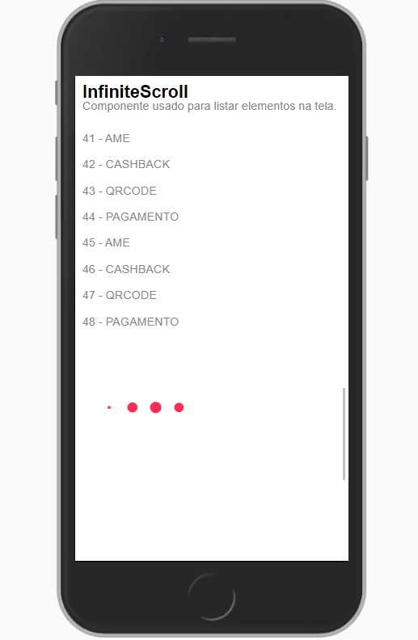
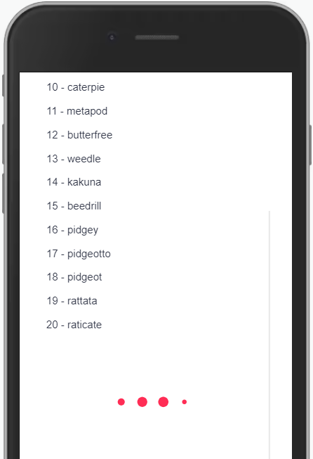

Semelhante ao Scroll Infinito do Twitter.




Modifique esse componente em tempo real pelo Storybook [clique aqui](https://ame-miniapp-components.calindra.com.br/storybook/?path=/story/listas-infinitescroll--basic)

## Utilização

### Preparo

```xml harmony
ITEMS = [
        { name: 'AME' },
        { name: 'CASHBACK' },
        { name: 'QRCODE' },
        { name: 'PAGAMENTO' },
        { name: 'AME' },
        { name: 'CASHBACK' },
        { name: 'QRCODE' },
        { name: 'PAGAMENTO' },
        { name: 'AME' },
        { name: 'CASHBACK' },
        { name: 'QRCODE' },
        { name: 'PAGAMENTO' },
        { name: 'AME' },
        { name: 'CASHBACK' },
        { name: 'QRCODE' },
        { name: 'PAGAMENTO' },
    ]

    generateItem = (item, index) => (
        <View key={`item_${index}`} borderBottomColor="#ccc" paddingVertical={20}>
            <Paragraph>{`${index + 1} - ${item.name}`}</Paragraph>
        </View>
    )

    addItems = () => {
        return new Promise((resolve) => {
            setInterval(() => {
                resolve(this.ITEMS)
            }, 2000)
        })
    }
```

### Implementação

```xml harmony
<InfiniteScroll
    heigth={'500px'}
    initialItems={this.ITEMS}
    renderItem={this.generateItem}
    onScrollEnd={this.addItems}
    endingFactor={100}
    showLoading={<ActivityIndicator />}
/>
```

## Propriedades

| Propriedade  | Descrição                                                                                                                                      | Type     | Default | Obrigatório |
|--------------|------------------------------------------------------------------------------------------------------------------------------------------------|----------|---------|-------------|
| height       | Altura que será utilizada.                                                                                                                     | String   | 100vh   | não         |
| initialItems | Itens iniciais que são exibidos na primeira exibição da lista.                                                                                 | Array    | null    | sim         |
| renderItem   | Funcção para manipular como itens serão apresentados.                                                                                          | Function | null    | sim         |
| onScrollEnd  | Funcção que retorna uma Promisse com um array de items para ser renderizado.                                                                   | Function | null    | sim         |
| endingFactor | Define uma altura para  até o fim do scroll que ao ser atingido, chamará a funcão **`onScrollEnd`**, iniciando o carregamento dos novos itens. | Number   | null    | sim         |
| showLoading  | Conteúdo que será exibido enquanto o processamento da lista é realizado.                                                                       | String   | null    | sim         |

## Exemplos

Abaixo, alguns exemplos usando o InfiniteScroll:



```xml

state = {
    nextPage: 20,
    nextPokemons: [],
    pokemons: [],
  };

componentDidMount() {
    axios.get('https://pokeapi.co/api/v2/pokemon/').then(response => {
      const firstPokemons = response.data;
      this.setState({ pokemons: firstPokemons.results });
    });
  }
  getNextPokemons(next) {
    axios
      .get(`https://pokeapi.co/api/v2/pokemon/?offset=${next}`)
      .then(response => {
        this.setState({ nextPokemons: response.data.results });
      });
  }

  generateItem = (item, index) => (
    <View key={`item_${index}`}>
      <Paragraph dataCy='infiniteScroll-item'>{`${index + 1} - ${
        item.name
      }`}</Paragraph>
    </View>
  );

   addItems = () => {
    this.setState({ nextPage: this.state.nextPage + 20 });
    this.getNextPokemons(this.state.nextPage);
    return new Promise(resolve => {
      setInterval(() => {
        resolve(this.state.nextPokemons);
      }, 1000);
    });
  };

<View justify='center' padding='none' paddingX='md' height={600}>
    <InfiniteScroll
    initialItems={this.state.pokemons}
    onScrollEnd={this.addItems}
    renderItem={this.generateItem}
    endingFactor={100}
    showLoading={
        <Animator animationData={StyleResolver.getLoadingAnimation()} />
    }
    />
</View>
```

---