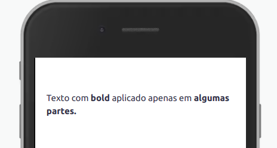

Ultilizado para inserção de código dentro dos componentes.

## Utilização



```xml
<View>
	<Text>
		Texto com [b]bold[/b] aplicado apenas em [b]algumas partes.[/b]
	</Text>
</View>
```

## Propriedades

## Propriedades

| Propriedade | Descrição                                                                                                                                 | Tag                           |
| ----------- | ----------------------------------------------------------------------------------------------------------------------------------------- | ----------------------------- |
| Negrito     | Todo o texto que estiver dentro da tag `[b]` receberá a propriedade negrito.                                                              | [b] [/b]                      |
| Itálico     | Todo o texto que estiver dentro da tag `[i]` receberá a propriedade itálico.                                                              | [i] [/i]                      |
| Sublinhado  | Todo o texto que estiver dentro da tag `[u]` receberá a propriedade sublinhado.                                                           | [u] [/u]                      |
| Strike      | Todo o texto que estiver dentro da tag `[s]` receberá a propriedade strike.                                                               | [s] [/s]                      |
| Cor         | Todo o texto que estiver dentro da tag `[color=token-cor]` receberá a cor passada como token. Saiba mais sobre cores em [color](color.md) | [color=token-da-cor] [/color] |

## Exemplos

Exemplo de texto com três bbcodes diferentes sendo aplicados juntos:


```xml
<View>
	<Text>
		[color=pluscolor-primary-dark][u]Texto sublinhado, com a dor [b]'pluscolor-primary-medium'[/b] e com [b]bold[/b].[/u][/color]
	</Text>
</View>
```

Exemplo com uma cor sendo aplicada em uma determinada parte do texto:


```xml
<View>
	<Text>
		[b]Cuide de você e da sua família, fique longe de imprevistos e ainda concorra a R$ 10 mil todo mês [color=amecolor-primary-medium]:)[/color][/b]
	</Text>
</View>
```

Exemplo com `strike`:


```xml
<View>
	<Text>
		[b]Cuide de você e da sua família, fique longe de imprevistos e ainda concorra a R$ 10 mil todo mês [color=amecolor-primary-medium]:)[/color][/b]
	</Text>
</View>
```
