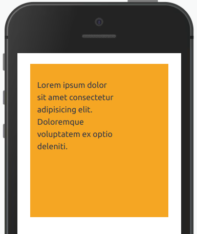

Componente que define um bloco com altura e largura definida.

## Utilização

```jsx
<Block width="300px" heigth="auto">
  {...children}
</Block>
```

## Propriedades

| Propriedade | Descrição                                                                                            | Type   | Default | Obritatório |
| ----------- | ---------------------------------------------------------------------------------------------------- | ------ | ------- | ----------- |
| width       | Valor atribuído para definir largura do bloco.                                                       | string | null    | não         |
| height      | Valor atribuído para definir altura do bloco.                                                        | string | null    | não         |
| position    | Define como o elemento sera posicionado. opções: `static`, `relative`, `absolute`, `sticky`, `fixed` | string | null    | não         |
| top         | Especifica uma posição vertical do elemento. Funciona apenas com a propriedade `position` setada.    | string | null    | não         |
| bottom      | Especifica uma posição vertical do elemento. Funciona apenas com a propriedade `position` setada.    | string | null    | não         |
| right       | Especifica uma posição horizontal do elemento. Funciona apenas com a propriedade `position` setada.  | string | null    | não         |
| left        | Especifica uma posição horizontal do elemento. Funciona apenas com a propriedade `position` setada.  | string | null    | não         |
| zIndex      | Indica o a ordem do z-index do elemento. Funciona apenas com a propriedade `position` setada.        | string | null    | não         |

## Exemplos



```jsx
<View padding="none" height="300px" background="categorycolor-waiting">
  <Block position="relative" top="10%" left="5%" width="150px" height="250px">
    <Text>
      Lorem ipsum dolor sit amet consectetur adipisicing elit. Doloremque
      voluptatem ex optio deleniti.
    </Text>
  </Block>
</View>
```
