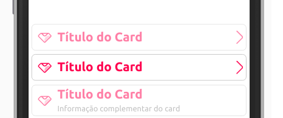
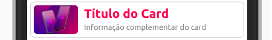
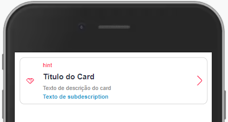
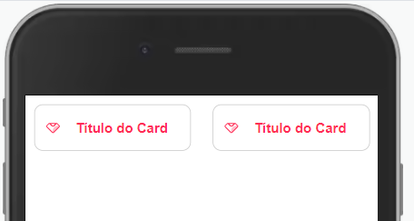

Card é um componente que contêm um conteúdo e ações sobre um determinado assunto.



<br>

Modifique esse componente em tempo real pelo Storybook [clique aqui](https://ame-miniapp-components.calindra.com.br/storybook/?path=/story/cards-card--basic)

<br>

## Utilização

```xml harmony
<Card
rightIcon='right-next'
icon={require('../assets/images/icon_ame.svg')}
title="Título do Card"
truncate={2}
disabled
/>
```

## Propriedades

| Propriedade         | Descrição                                                                                                                                                                                                                                                                                                                  | Type     | Default               | Obrigatório |
|---------------------|----------------------------------------------------------------------------------------------------------------------------------------------------------------------------------------------------------------------------------------------------------------------------------------------------------------------------|----------|-----------------------|-------------|
| title               | Texto que será exibido no título do card.                                                                                                                                                                                                                                                                                  | String   | null                  | não         |
| titleProps          | Propriedades de estilo do título, você atribui um objeto com o estilo que será utilizado dentro do título somente.                                                                                                                                                                                                         | Object   | null                  | não         |
| description         | Texto que será exibido na descrição do card.                                                                                                                                                                                                                                                                               | String   | null                  | não         |
| descriptionProps    | Propriedades de estilo da descrição, você atribui um objeto com o estilo que será utilizado dentro da descrição somente.                                                                                                                                                                                                   | Object   | null                  | não         |
| subdescription      | Texto que será exibido abaixo do descrição do card.                                                                                                                                                                                                                                                                        | String   | null                  | não         |
| subdescriptionProps | Propriedades de estilo da subdescrição você atribui um objeto com o estilo que será utilizado dentro da subdescrição somente.                                                                                                                                                                                              | Object   | null                  | não         |
| hint                | Texto que será exibido na linha de detalhamento superior do card.                                                                                                                                                                                                                                                          | String   | null                  | não         |
| hintProps           | Propriedades de estilo do hint, você atribui um objeto com o estilo que será utilizado dentro do hint somente.                                                                                                                                                                                                             | Object   | null                  | não         |
| rightIcon           | Ícone exibido a direita no Card. Recebe: Token do [ameIcon](ameIcon.md), endereço HTTPS da imagem do ícone ou endereço da imagem ícone local usando require.                                                                                                                                                               | String   | null                  | não         |
| rightIconColor      | Cor do icone usado na propriedade [RightIcon](#righticon). Opções: 'black', 'red'.                                                                                                                                                                                                                                         | String   | black                 | não         |
| leftIcon            | Ícone exibido a esquerda no Card. Recebe: Token do [ameIcon](ameIcon.md), endereço HTTPS da imagem do ícone ou endereço da imagem ícone local usando require.                                                                                                                                                              | String   | null                  | não         |
| leftIconColor       | Cor do icone usado na propriedade [LeftIcon](#lefticon). Opções: 'black', 'red'.                                                                                                                                                                                                                                           | String   | black                 | não         |
| image               | Endereço HTTPS da imagem ou endereço da imagem local usando require.                                                                                                                                                                                                                                                       | String   | null                  | não         |
| onClick             | Recebe uma função para ser executada em um evento de toque sobre o Card.                                                                                                                                                                                                                                                   | Function | null                  | não         |
| rightIconClick      | Recebe uma função para ser executada em um evento de toque sobre o ícone da direita no Card.                                                                                                                                                                                                                               | Function | null                  | não         |
| disabled            | Bloqueia o usuário de interagir com o Card.                                                                                                                                                                                                                                                                                | Boolean  | false                 | não         |
| truncate            | Com o truncate é possível selecionar a quantidade de linhas do texto desejada no `description`. Se o texto for de um tamanho que utilize linhas a mais, será cortado e acrescentado '...' ao final da linha. O valor deve ser passado em tipo number. Caso o `truncate` não seja atribuído, não haverá limitação de linha. | Number   | false                 | não         |
| border              | Adiciona uma borda no Card, [veja os valores](border.md)                                                                                                                                                                                                                                                                   | string   | hairline              | não         |
| borderRadius        | Define o arredondamento da borda, [veja os valores](border.md)                                                                                                                                                                                                                                                             | string   | md                    | não         |
| borderColor         | Define qual será a cor da borda, [veja os valores](color.md)                                                                                                                                                                                                                                                               | string   | neutralcolor-medium   | não         |
| background          | Adiciona uma cor de fundo, [veja os valores](color.md)                                                                                                                                                                                                                                                                     | string   | neutralcolor-lightest | não         |
| opacity             | Adiciona opacidade do card. [Saiba mais sobre opacidade](opacity.md)                                                                                                                                                                                                                                                       | string   | none                  | não         |
| inset               | Adiciona espaçamentos no card. [Saiba mais sobre espaçamentos](space.md)                                                                                                                                                                                                                                                   | string   | none                  | não         |
| squish              | Adiciona espaçamentos no card. [Saiba mais sobre espaçamentos](space.md)                                                                                                                                                                                                                                                   | string   | none                  | não         |
| visibility          | Define quando um componente fica visível ou invisível. [Saiba mais sobre visibilidade](visibility.md)                                                                                                                                                                                                                      | string   | visible               | não         |
## Exemplos

Abaixo, alguns exemplos usando o Card:



```jsx harmony
<Window>
  <Card
    image={require('../assets/images/logo_phone.png')}
    title={'Título do Card'}
    description={'Informação complementar do card'}
  />
</Window>
```
---



```xml
<View>
  <Card
    rightIcon={'right-next'}
    leftIcon={require('../assets/images/icon_ame.svg')}
    title={'Título do Card'}
    titleProps={{ fontSize: 'xxs', color: 'neutracolor-brand-darkest' }}
    description='Texto de descrição do card'
    descriptionProps={{ fontSize: 'micro', color: 'neutralcolor-dark' }}
    subdescription='Texto de subdescription'
    rightIconColor='red'
    hint='hint'
    hintProps={{ fontSize: 'micro', color: 'amecolor-primary-medium' }}
    rightIconClick={() => console.log('rightIconClick')}
    onClick={() => console.log('onClick')}
    />
</View>
```
---



```xml
  <View direction='row' padding='none'>
    <Card
      leftIcon={require('../assets/images/icon_ame.svg')}
      title='Título do Card'
      onClick={() => console.log('Card')}
    />
    <Spacing horizontal size='sm' />
    <Card
      leftIcon={require('../assets/images/icon_ame.svg')}
      title='Título do Card'
      onClick={() => console.log('Card')}
    />
  </View>
```
