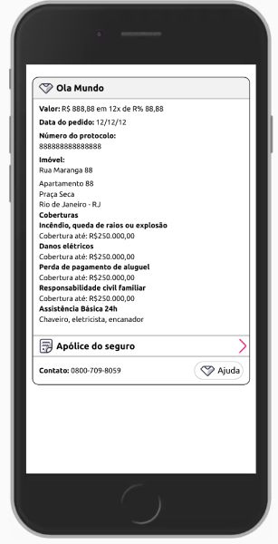

O componente Datasheet gera um card para apresentação de determinados dados e permite interação do usuário com um campo touchable e button próprio.



<br>

Modifique esse componente em tempo real pelo Storybook [clique aqui](https://ame-miniapp-components.calindra.com.br/storybook/?path=/story/cards-datasheet--basic)

<br>

## Utilização

```xml
<Datasheet title={{text: '[b]Ola Mundo[/b]', size: 'md', icon: 'ame-outline'}}>

  <Datasheet.Content>
    <Paragraph>
      ...Aqui vão os dados que deseja apresentar...
    </Paragraph>
  </Datasheet.Content>

  <Datasheet.TouchableContent onClick={() => console.log('touchable')}>
    <AmeIcon icon={'receipt-outline'} />
    <Paragraph size={'md'} color={'neutralcolor-darkest'}>
      [b]Apólice do seguro[/b]
    </Paragraph>
  </Datasheet.TouchableContent>

  <Datasheet.Footer>
    <Paragraph size={'xs'} color={'neutralcolor-darkest'}>[b]Contato: [/b] 0800-709-8059</Paragraph>
    <Datasheet.Button onClick={() => console.log("button")}>
      <AmeIcon icon={'ame-outline'} />
      <Paragraph size={'sm'} color={'neutralcolor-darkest'}>Ajuda</Paragraph>
    </Datasheet.Button>
  </Datasheet.Footer>

</Datasheet>
```
## Propriedades

| Propriedade | Descrição                                         | Type     | Default | Obrigatório |
|-------------|---------------------------------------------------|----------|---------|-------------|
| title       | Pode-se utilizar os atributos: text, size e icon. | Object   | null    | sim         |
| onClick     | Função que executa a interação do usuário.        | Function | null    | sim         |

## Props.children

| Propriedade                | Descrição                                                                           | Type     | Default | Obrigatório |
|----------------------------|-------------------------------------------------------------------------------------|----------|---------|-------------|
| Datasheet.Content          | Onde ficará todo o conteúdo que será apresentado no card.                           | Children | null    | não         |
| Datasheet.TouchableContent | Utilizada para criação de um conteúdo que permite a interação do usuário por touch. | Children | null    | não         |
| Datasheet.Footer           | Utilizada para criar um rodapé.                                                     | Children | null    | não         |
| Datasheet.Button           | Cria um botão dentro do Datasheet para interação do usuário.                        | Children | null    | não         |

## Exemplos

Abaixo, alguns exemplos usando o Datasheet:


```xml
  <Datasheet
    title={{
      text: '[b]Olá Mundo[/b]',
      size: 'md',
      icon: 'ame-outline',
    }}>
    <Datasheet.Content>
      <Text
        size={'xs'}
        color={'neutralcolor-darkest'}>
        [b]Valor:[/b] R$ 888,88 em 12x de R% 88,88
      </Text>
      <Spacing />
      <Text size={'xs'} color={'neutralcolor-darkest'}>
        [b]Data do pedido:[/b] 12/12/12
      </Text>
      <Spacing />
    </Datasheet.Content>
    <Datasheet.TouchableContent
      onClick={() => alert('touchable clicado')}>
      <Image 
        icon={'receipt-outline'} 
        color={'neutralcolor-darkest'}
      />
      <Text size={'md'} color={'neutralcolor-darkest'}>
        [b]Apólice do seguro[/b]
      </Text>
    </Datasheet.TouchableContent>

    <Datasheet.Footer>
      <View justify='center' width='100%' flexWrap='wrap'>
        <View width='100%' flexNone>
          <Text
            textAlign='center'
            size={'xs'}
            color={'neutralcolor-darkest'}
          >
            [b]Contato: [/b] 0800-709-8059
          </Text>
        </View>
        <Datasheet.Button onClick={() => alert('button clicado')}>
          <Image 
            icon={'ame-outline'}
            color={'neutralcolor-darkest'} 
          />
          <Text size={'sm'} color={'neutralcolor-darkest'}>
            Siga para página do SAC
          </Text>
        </Datasheet.Button>
      </View>
    </Datasheet.Footer>
  </Datasheet>
```