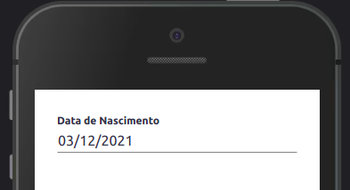

Este componente funciona como uma área interativa, quando tocado ele invoca ou seleciona a data nativa de cada plataforma.

## Exemplo

<br>



<br>

## Modifique esse componente em tempo real pelo Storybook [clique aqui](https://ame-miniapp-components.calindra.com.br/storybook/?path=/story/intera%C3%A7%C3%B5es-datepicker--basic)

<br>

## Utilização

<br>

```jsx harmony
state = {
  date: new Date(),
  minDate: new Date(1930, 1, 1),
  maxDate: new Date(2005, 12, 31),
};

onDateChange = (value) => {
  this.setState({
    date: value,
  });
};

...

<View padding="sm">
  <DatePicker
    value={this.state.date}
    minDate={this.state.minDate}
    maxDate={this.state.maxDate}
    onChange={(e) => this.onDateChange(e)}
    format={"DD/MM/YYYY"}
    label="Data de Nascimento"
  />
</View>;
```

## Propriedades

| Propriedade | Descrição                                                       | Type                  | Default      |
|-------------|-----------------------------------------------------------------|-----------------------|--------------|
| value       | Determina uma data inicial para o componente.                   | Date Object ou string | null         |
| minDate     | Determina a menor data possível.                                | Date Object ou string | null         |
| maxDate     | Determina a maior data possível.                                | Date Object ou string | null         |
| onChange    | Recebe uma função que retorna a data selecionada no componente. | function              | null         |
| format      | Formato de exibição da data.                                    | string                | 'DD/MM/YYYY' |
| label       | Texto mostrado acima da data.                                   | string                | null         |
| disabled    | Desabilita o compoennte                                         | boolean               | null         |
| placeholder | Determina o placeholder do componente                           | string                | ' '          |

## Formatos

Formatos de data aceitos (value, minData, maxData):

- new Date()
- new Date(YYYY, MM, DD)
- "YYYY-MM-DD"
- "YYYYMMDD"

Formatos de data aceitos (format):

- DD/MM/YYYY - Retorna: 12/08/2019
- D [de] MMMM [de] YYYY - Retorna: 12 de Agosto de 2019

Para mais opções de formatos de datas acesse o site da [MomentJS](https://momentjs.com/docs/#/displaying/format/)

## Exemplos


```jsx harmony
<View padding="sm">
  <Input
    label="Nome Completo"
    inputMode="text"
    type="text"
    placeholder="Ex: Alberto Gomes"
    onChange={(e) => this.setState({ name: e })}
  />
  <Spacing size="xs" />
  <Input
    inputMode="email"
    label="email"
    placeholder="Ex: alberto.gomes@email.com"
    onChange={(e) => this.setState({ email: e })}
  />
  <Spacing size="xs" />
  <DatePicker
    value={new Date()}
    minDate={"1930-01-02"}
    maxDate={"2013-12-31"}
    onChange={(e) => console.log(e)}
    format={"DD/MM/YYYY"}
    label="Data de Nascimento"
  />
</View>
```
