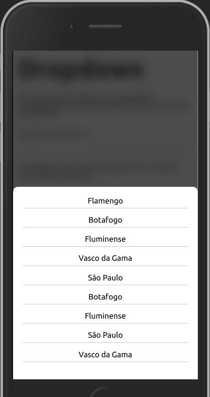
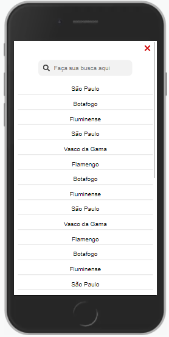
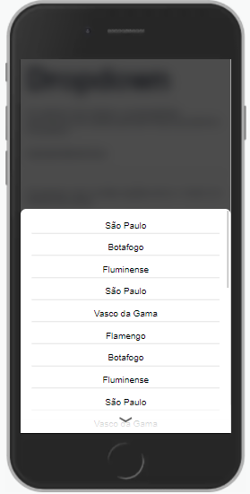

Exibe na tela um componente para esolha de opções.

## Exemplo



## Modifique esse componente em tempo real pelo Storybook [clique aqui](https://ame-miniapp-components.calindra.com.br/storybook/?path=/story/intera%C3%A7%C3%B5es-dropdownbutton--basic)

## Utilização

### Preparo

Defina uma lista de objetos chave valor com as chaves `value` e `label`.

- A propriedade `label` refere-se ao texto mostrado ao usuário.
- A propriedade `value` refere-se ao valor da opção selecionada.

```javascript
const soccerClubs = [
  {
    value: 'FLA',
    label: 'Flamengo'
  },
  {
    value: 'BOT',
    label: 'Botafogo'
  },
  {
    value: 'FLU',
    label: 'Fluminense'
  },
  {
    value: 'VAS',
    label: 'Vasco da Gama'
  }
]
```

### Implementação

```xml
<Window>
  <DropdownButton
    label="Para qual time você torce?"
    placeholder="Selecione um clube de futebol"
    value={'Flamengo'}
    optionList={soccerClubs}
    onChange={(e) => {
      selectChange(e)
    }}
  />
</Window>
```

## Propriedades

| Propriedade | Descrição                                                                                                                                                               | Type             | Default |
|-------------|-------------------------------------------------------------------------------------------------------------------------------------------------------------------------|------------------|---------|
| placeholder | Texto a ser exibido no rótulo do componente quando não há nada selecionado.                                                                                             | string           | null    |
| optionList  | Recebe um array de objetos com as opções para o cliente selecionar.                                                                                                     | string           | null    |
| label       | Texto mostrado acima do campo de seleção de opções.                                                                                                                     | string           | null    |
| keyLabel    | Essa propriedade troca qual a informação que será exibida para o usuário, ao invés de ser label, pode ser qualquer outra parte dentro do objeto como name, title e etc. | string           | label   |
| value       | Recebe uma string ou um objeto que define o valor default do componente. Pode ser passado o objeto completo e ele automaticamente irá pegar o label que será exibido.   | String ou Object | null    |
| disabled    | Desabilita o campo                                                                                                                                                      | Boolean          | false   |
| hideSearch  | Quando o DropdownButton tem mais de 9 itens, por padrão um modal com o campo de busca é aberto, a propriedade hideSearch esconde o campo de busca.                      | Boolean          | false   |
| onChange    | Função que retorna a opção selecionada quando o cliente escolhe uma das opções.                                                                                         | Function         | null    |
| id          | Atribuiu um **id** ao DropdownButton. Indica qual elemento irá receber o `focus` através da propriedade `nextInputId`.                                                  | String           | null    |
| nextInputId | Permite que o DropdownButton atual realize `focus` no DropdownButton Input referenciado pelo `id`.                                                                      | String           | null    |

<br>

## Exemplos:
<br>

**OBS:** Por padrão se o optionList receber um array com 9 ou mais itens o DropdownButton será exibida em toda a tela. 



```xml
<DropdownButton
  placeholder='Selecione um clube de futebol'
  optionList={this.state.optionListModal} //array com mais de 9 itens
  onChange={e => {console.log(e)}}
  value={this.state.selected}
 />
```
<br>

Mesmo exemplo de optionList anterior, mas agora usando o hideSearch. 



```xml
<DropdownButton
  hideSearch ={true}
  placeholder='Selecione um clube de futebol'
  optionList={this.state.optionListModal} //array com mais de 9 itens
  onChange={e => {console.log(e)}}
  value={this.state.selected}
 />
```
