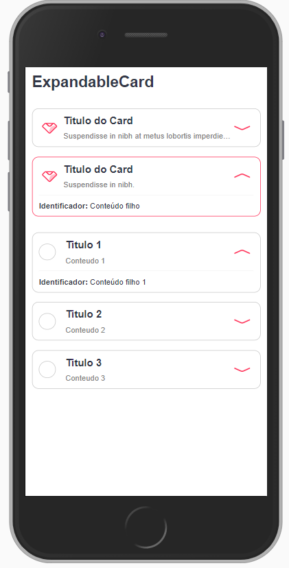
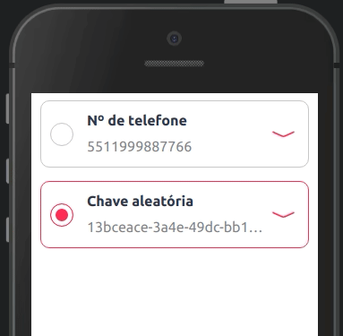

ExpandableCard é um componente que cria um card expansível para exibir informações.



<br>

Modifique esse componente em tempo real pelo Storybook [clique aqui](https://ame-miniapp-components.calindra.com.br/storybook/?path=/story/cards-expandablecard--collapse)

<br>

## Utilização

### Tipo collapse

```xml harmony
<ExpandableCard>
    <ExpandableCard.Item
    titleIcon={require('../assets/images/icon_ame.svg')}
    title='Titulo do Card'
    description={'Descrição exibida embaixo do Titulo.'}
    >
      <Paragraph>[b]Identificador:[/b] Conteúdo filho</Paragraph>
    </ExpandableCard.Item>
</ExpandableCard>
```

### Tipo selection

```xml harmony
<ExpandableCard type='selection' radioName='seletor' onChange={value => console.log(value)}>
    <ExpandableCard.Item
    titleIcon={require('../assets/images/icon_ame.svg')}
    title='Titulo 1'
    description={'Conteudo 1'}
    radioValue='Valor 1'
    >
      <Paragraph size='xs'>[b]Identificador:[/b] Conteúdo filho 1</Paragraph>
    </ExpandableCard.Item>

    <ExpandableCard.Item
    titleIcon={require('../assets/images/icon_ame.svg')}
    title='Titulo 2'
    description={'Conteudo 2'}
    radioValue='Valor 2'
    >
      <Paragraph size='xs'>[b]Identificador:[/b] Conteúdo filho 2</Paragraph>
    </ExpandableCard.Item>

</ExpandableCard>
```

## Propriedades

Veja abaixo quais são as propriedades para esse componente

### ExpandableCard

Propriedades para a tag ExpandableCard

| Propriedade | Descrição                                                                                                                                                                                                              | Type     | Default  | Obrigatório |
| ----------- | ---------------------------------------------------------------------------------------------------------------------------------------------------------------------------------------------------------------------- | -------- | -------- | ----------- |
| type        | Aplica o tipo do ExpandableCard, podendo ser entre 'collapse' e 'selection'.                                                                                                                                           | String   | collapse | não         |
| radioName   | Caso o tipo do ExpandableCard seja **selection**, se faz necessário atribuir a propriedade **radioName**, que será o name do radio. Caso essa propriedade não seja atribuída, o radio não fará a seleção corretamente. | String   | null     | não         |
| onChange    | Função a ser executada cada vez que é alterado o radio selecionado. Recebe como parametro o value do radio selecionado, entregue pelo componente.                                                                      | Function | null     | sim         |
| resetSelect | Essa propriedade recebe um booleano, no caso de ser true reseta o radio do ExapandableCard.                                                                                                                            | Boolean  | false    | não         |
| disabled    | Desabilita a interação com o componente.                                                                                                                                                                               | Boolean  | false    | não         |
| checked     | Caso o tipo do ExpandableCard seja **selection**, recebe o value do item desejado para que o componente renderize com a opção já selecionada.                                                                          | String   | null     | não         |

### ExpandableCard.Item

Propriedades para a Props.children ExpandableCard.Item

| Propriedade      | Descrição                                                                                                                                                                                           | Type   | Default | Obrigatório |
| ---------------- | --------------------------------------------------------------------------------------------------------------------------------------------------------------------------------------------------- | ------ | ------- | ----------- |
| title            | Titulo do card a ser exibido. Suporta BBCode                                                                                                                                                        | String | null    | não         |
| titleProps       | Propriedades de estilo do título, você atribui um objeto com o estilo que será utilizado dentro do título. Exemplo: `titleProps={{ size: 'xs', color: 'neutralcolor-dark' }}`                       | Object | null    | não         |
| description      | Descrição a ser exibida logo abaixo do titulo. Suporta BBCode                                                                                                                                       | String | null    | não         |
| descriptionProps | Propriedades de estilo da description, você atribui um objeto com o estilo que será utilizado dentro da description. Exemplo: `descriptionProps={{ size: 'xs', color: 'neutralcolor-dark' }}`       | Object | null    | não         |
| titleIcon        | Ícone que será renderizado caso o tipo do componente seja **collapse**. Recebe: Token do [ameIcon](ameIcon.md), endereço HTTPS da imagem do ícone ou endereço da imagem ícone local usando require. | String | null    | não         |
| truncate         | Quantidade de linhas do texto desejada no description. Se o texto for de um tamanho que utilize linhas a mais, será cortado e acrescentado '...' ao final da linha.                                 | Number | null    | não         |
| radioValue       | Caso o tipo do componente seja **selection**, utilize essa propriedade para atribuir um valor ao ítem. Este valor será retornado como parametro na propiedade onChange.                             | String | null    | não         |

## Exemplos

Abaixo, alguns exemplos usando o ExpandableCard:


F

```xml
items = [
    {
      image: 'ame-outline',
      title: 'Título do primeiro',
      description:
        'Suspendisse in nibh at metus lobortis imperdiet id sit amet velit. Proin tincidunt felis id sapien lacinia sagittis. Maecenas in dui ornare elit mollis tincidunt ac ut elit.',
    },
    {
      image: require('../assets/images/icon_signup.svg'),
      title: 'Título do segundo',
      description:
        'Suspendisse in nibh at metus lobortis imperdiet id sit amet velit. Proin tincidunt felis id sapien lacinia sagittis. Maecenas in dui ornare elit mollis tincidunt ac ut elit.',
    },
  ];

<View>
  <ExpandableCard>
    {this.items.map((res, index) => (
      <ExpandableCard.Item
        key={index}
        title={res.title}
        truncate={1}
        description={res.description}
        titleIcon={res.image}>
        <Text size='xs'>
          [b]Identificador:[/b] Conteúdo filho {index.toString()}
        </Text>
      </ExpandableCard.Item>
    ))}
  </ExpandableCard>
</View>
```

---

Exemplo de uso do type `selection`:




```jsx
<ExpandableCard
  type="selection"
  radioName="pixKeys"
  checked={this.state.checkedKey}
  onChange={(value) => handleKeySelection(value)}
  resetSelect={this.state.resetKeyValue}
>
  {this.state.keys.map((key, index) => {
    <ExpandableCard.Item
      title={key.title}
      truncate={1}
      description={key.description}
      radioValue={key.id}
    >
      <View direction="row" align="center" padding="none">
        <View padding="none">
          <Text truncate={2} fontSize="xxs">
            [b]Chave[/b]:[color:amecolor-primary-medium]{this.state.keys.id}
            [/color]
          </Text>
          <Text fontSize="xxxs" color="neutralcolor-dark" fontHeight="medium">
            Criada em {this.state.keys.createdAt}
          </Text>
        </View>
        <View direction="row" align="center" padding="none" width="auto">
          {this.state.openOptions ? (
            <View padding="none" direction="row" align="center">
              <Touchable onClick={() => this.handleShareKey()}>
                <Image icon="share-outline" color="amecolor-primary-medium" />
              </Touchable>
              <Touchable onClick={() => this.handleDeleKey()}>
                <Image icon="trash-outline" color="amecolor-primary-medium" />
              </Touchable>
            </View>
          ) : null}
          <Touchable onClick={() => this.handleShowOptions()}>
            <Image icon="details" color="amecolor-primary-medium" />
          </Touchable>
        </View>
      </View>
    </ExpandableCard.Item>
  })}
</ExpandableCard>
```
