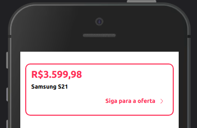

Utilizado para a descrição de preços dos produtos.


<br>

## Modifique esse componente em tempo real pelo Storybook [clique aqui](https://ame-miniapp-components.calindra.com.br/storybook/?path=/story/cards-flatcard--small)

<br>

## Utilização

```jsx
<FlatCard
  onClick={() => console.log('FlatCard')}
  size={'large'}
  price={100000}
  conditionPayment="em até 12x parcelas"
  paymentshape="Jeitto"
/>
```

## Propriedades

| Propriedade           | Descrição                                                                                                                    | Type    | Default | Obrigatório |
| --------------------- | ---------------------------------------------------------------------------------------------------------------------------- | ------- | ------- | ----------- |
| size                  | Define o tipo de FlatCard a ser utilizado. Valores aceitos: `large`, `small`                                                 | string  | 'large' | não         |
| price                 | Descrição do preço do produto.                                                                                               | number  | null    | sim         |
| priceProps            | Propriedades de descrição do preço, você atribui um objeto com o estilo que será utilizado dentro do título.                 | object  | null    | não         |
| conditionPayment      | Descrição da condição de pagamento.                                                                                          | string  | null    | sim         |
| conditionPaymentProps | Propriedades de descrição do condição de pagamento, você atribui um objeto com o estilo que será utilizado dentro do título. | object  | null    | não         |
| disabled              | Bloqueia o usuário de interagir com o FlatCard.                                                                              | boolean | true    | não         |
| border                | Altera o tamanho da borda. [Saiba mais sobre bordas](border.md)                                                              | string  | true    | não         |
| borderRadius          | Altera o tamanho do arredondamento da borda. [Saiba mais sobre bordas](border.md)                                            | string  | true    | não         |
| borderColor           | Altera a cor do border. [Saiba mais sobre cores](color.md)                                                                   | string  | true    | não         |
| background            | Altera a cor de fundo do card. [Saiba mais sobre cores](color.md)                                                            | string  | true    | não         |
| opacity               | Altera a opacidade do card. [Saiba mais sobre opacidade](opacity.md)                                                         | string  | true    | não         |
| visibility            | Altera a visibilidade do card entre `hidden` ou `visible`. [Saiba mais sobre visibilidade](visibility.md)                    | string  | true    | não         |

## FlatCard Large

| Propriedade  | Descrição                                                                                                                 | Type     | Default | Obrigatório |
| ------------ | ------------------------------------------------------------------------------------------------------------------------- | -------- | ------- | ----------- |
| paymentShape | Descrição da forma de pagamento.                                                                                          | string   | null    | não         |
| paymentShape | Propriedades de descrição do forma de pagamento, você atribui um objeto com o estilo que será utilizado dentro do título. | object   | null    | não         |
| button       | Descrição do botão que carrega a função de click da prop onClick.                                                         | string   | null    | não         |
| buttonProps  | Propriedades de descrição do botão, você atribui um objeto com o estilo que será utilizado dentro do título.              | oject    | null    | não         |
| onClick      | Recebe uma função para ser executada em um evento de toque sobre o texto descrito na prop button.                         | function | null    | não         |

## FlatCard Small

| Propriedade | Descrição                                                                                                    | Type   | Default | Obrigatório |
| ----------- | ------------------------------------------------------------------------------------------------------------ | ------ | ------- | ----------- |
| rate        | Descrição do juros pagamento.                                                                                | string | null    | não         |
| rateProps   | Propriedades de descrição do juros, você atribui um objeto com o estilo que será utilizado dentro do título. | object | null    | não         |
| onClick     | Recebe uma função para ser executada em um evento de toque sobre o FlatCard.                                 | object | null    | não         |

## Deprecated

| Propriedade | Descrição                                                                                           | Type   | Default |
| ----------- | --------------------------------------------------------------------------------------------------- | ------ | ------- |
| squish      | Essa propriedade foi substituída pela propriedade padding. [Saiba mais sobre espaçamento](space.md) | string | null    |
| inset       | Essa propriedade foi substituída pela propriedade margin. [Saiba mais sobre espaçamento](space.md)  | string | null    |

## Exemplos


```xml
<View>
<FlatCard
size={'small'}
price={100000}
conditionPayment={'em até 12x parcelas'}
rate={'Juros: 4,8%'}
/>
</View>
```

---


```jsx
<Grid columns={2}>
  <FlatCard
    size={'large'}
    price={25990}
    borderColor="neutralcolor-darkest"
    conditionPayment={'[b]10% off no Boleto[/b]'}
  />

  <FlatCard
    size={'large'}
    borderColor="neutralcolor-darkest"
    price={14998}
    conditionPayment={'[b]10% off no Boleto[/b]'}
  />
</Grid>
```

---



```jsx
<FlatCard
  size={'large'}
  price={359998}
  paymentshape="Samsung S21"
  button="Siga para a oferta"
  onClick={() => this.handleCardClick}
/>
```
