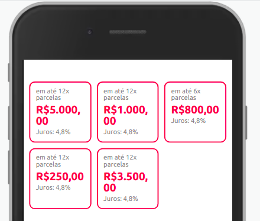

Utilize este componente para alinhar vários componentes em uma mesma linha.
Ele divide o espaço exatamente pelo número de componentes dentro dele.


## Modifique esse componente em tempo real pelo [Storybook](https://ame-miniapp-components.calindra.com.br/storybook/?path=/story/componentes-simples-grid--basic)

## Utilização

```xml
<Grid>
    <Paragraph>Preço</Paragraph>
    <Paragraph>R$50,00</Paragraph>
</Grid>
```

## Propriedades

| Propriedade | Descrição                                       | Type   | Default |
|-------------|-------------------------------------------------|--------|---------|
| columns     | Indica quantas colunas o grid terá. Marimo de 5 | number | null    |

## Exemplo:


```xml
<Grid columns={2} dataCy='grid'>
  <Circle icon={require('../assets/images/icon_ame.svg')} />
  <Circle icon={require('../assets/images/icon_ame.svg')} />
  <Circle icon={require('../assets/images/icon_ame.svg')} />
  <Circle icon={require('../assets/images/icon_ame.svg')} />
</Grid>
```

## Outros exemplos

### Usando 2 Buttons


```xml
<Grid columns={2}>
  <Button label='Primeiro botão' />
  <Button label='Segundo Botão' type='secondary' />
</Grid>
```

### Utilizando 5 FlatCard's com grid de 3



```xml
<Grid columns={3}>
  <FlatCard
        size={'small'}
        price={500000}
        conditionPayment={'em até 12x parcelas'}
        rate={'Juros: 4,8%'}
    />
  <FlatCard
        size={'small'}
        price={100000}
        conditionPayment={'em até 12x parcelas'}
        rate={'Juros: 4,8%'}
    />
  <FlatCard
        size={'small'}
        price={80000}
        conditionPayment={'em até 6x parcelas'}
        rate={'Juros: 4,8%'}
    />
  <FlatCard
        size={'small'}
        price={25000}
        conditionPayment={'em até 12x parcelas'}
        rate={'Juros: 4,8%'}
    />
  <FlatCard
        size={'small'}
        price={350000}
        conditionPayment={'em até 12x parcelas'}
        rate={'Juros: 4,8%'}
    />
</Grid>
```
