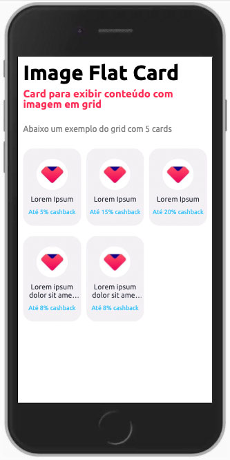

ImageFlatCard é um componente para exibição de cards em grid. Cada card contém uma imagem em formato circular, um título e um subtítulo.



```jsx harmony
<ImageFlatCard
  onClick={(index) => console.log(index)}
  content={this.state.arrayCards}
/>
```

## Modifique esse componente em tempo real pelo Storybook [clique aqui](https://ame-miniapp-components.calindra.com.br/storybook/?path=/story/cards-imageflatcard--basic)

## Propriedades

| Propriedade | Descrição                                                                | Type     | Default | Obrigatório |
| ----------- | ------------------------------------------------------------------------ | -------- | ------- | ----------- |
| content     | Essa propriedade recebe o array com os objetos que precisam ser exibidos | array    | null    | sim         |
| onCick      | Recebe uma função que retorna o index de qual card foi clicado.          | function | null    | sim         |

### content

Cada objetos do array recebe os seguinte

| Propriedade | Descrição                                                                | Type   | Default | Obrigatório |
| ----------- | ------------------------------------------------------------------------ | ------ | ------- | ----------- |
| title       | Essa propriedade recebe o array com os objetos que precisam ser exibidos | string | null    | sim         |
| subtitle    | Recebe uma função que retorna o index de qual card foi clicado.          | string | null    | sim         |
| image       | Recebe uma função que retorna o index de qual card foi clicado.          | string | null    | sim         |

## Exemplos


```js
state = {
  productsCards: [
    {
      title: 'Xbox',
      subtitle: 'Até 5% cashback',
      image: require('../assets/images/Ellipse-500.png')
    },
    {
      title: 'Playstation',
      subtitle: 'Até 5% cashback',
      image: require('../assets/images/Ellipse-500-1.png')
    },
    {
      title: 'Steam',
      subtitle: 'Até 5% cashback',
      image: require('../assets/images/Ellipse-500-2.png')
    },
    {
      title: 'Blizzard',
      subtitle: 'Até 5% cashback',
      image: require('../assets/images/Ellipse-500-3.png')
    },
    {
      title: 'Riot',
      subtitle: 'Até 5% cashback',
      image: require('../assets/images/Ellipse-500-4.png')
    },
    {
      title: 'Nintendo',
      subtitle: 'Até 5% cashback',
      image: require('../assets/images/Ellipse-500-5.png')
    },
    {
      title: 'Level Up',
      subtitle: 'Até 8% cashback',
      image: require('../assets/images/Ellipse-500-6.png')
    }
  ]
}
```

```jsx
<View>
  <Text fontSize="xs" fontWeight="bold">
    Games
  </Text>
  <Spacing size="sm" />
  <ImageFlatCard onClick={(index) => setCard(index)} content={arrayCards} />
</View>
```
