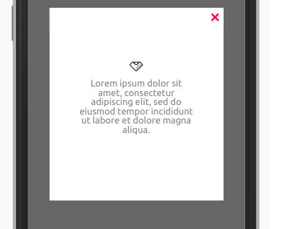

Este componente é utilizado para exibir uma mensagem de alerta.

## Exemplo



<br>

## Modifique esse componente em tempo real pelo Storybook [clique aqui](https://ame-miniapp-components.calindra.com.br/storybook/?path=/story/intera%C3%A7%C3%B5es-information--basic)

<br>

## Utilização

```xml
  constructor() {
  super()
  this.state = {
  value: false
    }
    }

  handleRender = () => {
  this.setState({ value: !this.state.value })
  };
<View>

<Information display={this.state.value} onClose={this.handleRender}>
<Paragraph>Lorem ipsum dolor sit amet, consectetur adipiscing elit, sed do eiusmod tempor incididunt ut labore et dolore magna aliqua.</Paragraph>
</Information>
</View>
```

### Propriedades

### display

- Type: Boolean
- Opcional

Exibe ou oculta o alerta através do estado (state).

### onClose

- Type: Boolean
- Opcional

Função a ser executada trata aberto e fechamento do modal através do estado (state).

### text

- Type: String
- Opcional

Aceita um componente do tipo texto.
