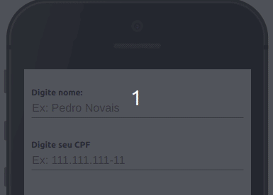

Insere um campo para inserção de dados.

## Exemplo


## Modifique esse componente em tempo real pelo Storybook [clique aqui](https://ame-miniapp-components.calindra.com.br/storybook/?path=/story/intera%C3%A7%C3%B5es-input--basic)

## Utilização

```jsx
<View>
  <Input
    label="Label do Input"
    placeholder="Placeholder"
    onChange={(e) => this.setState({ inputPadrao: e })}
  />
</View>
```

## Propriedades

| Propriedade         | Descrição                                                                                                                                                            | Type     | Default |
| ------------------- | -------------------------------------------------------------------------------------------------------------------------------------------------------------------- | -------- | ------- |
| type                | Define o tipo do campo input. [Veja as opções](#type)                                                                                                                | string   | text    |
| icon                | Nome do ícone a ser exibido no lado direito do Input. São os mesmos nomes do componente AmeIcon.                                                                     | string   | null    |
| iconPath            | Path do ícone a ser exibido no lado direito do Input, caso o ícone seja local no projeto.                                                                            | string   | null    |
| onClickIcon         | Função a ser executada quando tocar/clicar o ícone.                                                                                                                  | function | null    |
| inputMode           | Altera o modo do campo e tipo de teclado. [Veja as opções](#inputmode)                                                                                               | string   | text    |
| mode                | Altera o modo do campo e exibe um ícone para os modos. [Veja as opções](#mode)                                                                                       | string   | null    |
| placeholder         | Texto descritivo dentro do input.                                                                                                                                    | string   | null    |
| label               | Rótulo do input.                                                                                                                                                     | string   | null    |
| hint                | Permite adicionar uma mensagem logo abaixo do input, indicando um erro ou informação importante.                                                                     | string   | null    |
| id                  | Atribuiu um **id** ao input. Indica qual elemento irá receber o `focus` através da propriedade `nextInputId` ou `previousInputId`.                                   | string   | null    |
| nextInputId         | Faz referência ao id do próximo input para dar **focus**.                                                                                                            | string   | null    |
| previousInputId     | Faz referência ao id do input anterior para dar **focus**.                                                                                                           | string   | null    |
| mask                | Indica que o conteúdo do input deverá ser formatado de acordo com uma máscara.                                                                                       | string   | null    |
| autoCapitalize      | Atributo que sugere ao sistema operacional adicionar uma letra maiúscula nas sentenças conforme o valor. [Veja as opções](#autocapitalize)                           | string   | null    |
| spellcheck          | Este atributo permite ativar ou desativar a checagem de ortografia.                                                                                                  | boolean  | null    |
| autocorrect         | Atributo que indica se é necessário ativar ou não a correção automática enquanto o usuário estiver editando este campo. Obrigatório uso da propriedade `spellcheck`. | bollean  | null    |
| disabled            | Desabilita o campo.                                                                                                                                                  | boolean  | null    |
| onChange            | Função a ser executada quando o valor é alterado.                                                                                                                    | function | null    |
| onSubmit            | Função a ser executada ao submeter o campo.                                                                                                                          | function | null    |
| value               | Define o valor do campo.                                                                                                                                             | any      | null    |
| password            | Altera o campo para o tipo senha.                                                                                                                                    | boolean  | null    |
| autoNextOnFill      | Localiza automaticamente o próximo campo input a ser preenchido quando este atinge o limite máximo de caracteres. Obrigatório: `maxLength` e `nextInputId`           | boolean  | null    |
| autoPreviousOnEmpty | Localiza automaticamente o campo input anterior a ser preenchido quando o usuário digita backspace em um input vazio. Obrigatório: `maxLength` e `previousInputId`   | boolean  | null    |
| autoComplete        | Preenchimento automático do campo. [Veja as opções](#autocomplete)                                                                                                   | boolean  | null    |
| multiline           | Permite múltiplas linhas ao componente. Tem valor false como padrão.                                                                                                 | boolean  | null    |
| maxLength           | Indica o limite máximo de caracteres.                                                                                                                                | boolean  | number  |

## Deprecated

| Propriedade | Descrição                                 | Type   | Default |
| ----------- | ----------------------------------------- | ------ | ------- |
| search      | Altera o modo do campo e tipo de teclado. | string | null    |

## Valores de props:

#### type:

- `"text"`
- `"tel"`
- `"url"`
- `"email"`
- `"password"`
- `"number"`
- `password"`

#### inputMode:

- `"none"`
- `"text"`
- `"decimal"`
- `"numeric"`
- `"tel"`
- `"search"`
- `"email"`
- `"url"`

### mode

- `"success"`
- `"error"`
- `"danger"`
- `"warning"`

### autoCapitalize

- `'off'` - Não aplica capitalização.
- `'on'` - Aplica capitalização padrão do sistema operacional.
- `'sentences'` - Tenta aplicar capitalização em frases.
- `'words'` - Tenta aplicar capitalização em palavras.
- `'characters'` - Tenta aplicar caixa alta em todas as letras.

### autoComplete:

- `'off'`
- `'on'`
- `'name`'
- `'honorific-prefix'`
- `'given-name'`
- `'additional-name'`
- `'family-name'`
- `'honorific-suffix'`
- `'nickname'`
- `'email'`
- `'username'`
- `'new-password'`
- `'current-password'`
- `'one-time-code'`
- `'organization-title'`
- `'organization'`
- `'street-address'`
- `'address-line1'`
- `'address-line2'`
- `'address-line3'`
- `'address-level4'`
- `'address-level3'`
- `'address-level2'`
- `'address-level1'`
- `'country'`
- `'country-name'`
- `'postal-code'`
- `'cc-name'`
- `'cc-given-name'`
- `'cc-additional-name'`
- `'cc-family-name'`
- `'cc-number'`
- `'cc-exp'`
- `'cc-exp-month'`
- `'cc-exp-year'`
- `'cc-csc'`
- `'cc-type'`
- `'transaction-currency'`
- `'transaction-amount'`
- `'language'`
- `'bday'`
- `'bday-day'`
- `'bday-month'`
- `'bday-year'`
- `'sex'`
- `'tel'`
- `'tel-country-code'`
- `'tel-national'`
- `'tel-area-code'`
- `'tel-local'`
- `'tel-extension'`
- `'impp'`
- `'url'`
- `'photo'`

## Exemplos



```jsx
<View paddingY="sm">
  <Input
    label="Digite nome:"
    inputMode="text"
    placeholder="Ex: Pedro Novais"
    autoComplete="off"
    id="name"
    nextInputId="cpf"
    onChange={(e) => this.setState({ inputPadrao: e })}
  />
  <Spacing size="md" />
  <Input
    placeholder="Ex: 111.111.111-11"
    inputMode="numeric"
    mask="999.999.999-99"
    label="Digite seu CPF"
    id="cpf"
  />
</View>
```

---

No Exemplo abaixo foi criado um campo de comentário, com quantidade máxima de caractéres:


```jsx harmony
state = {
  commentField: "",
};
<View
  padding="xxxs"
  borderRadius="sm"
  border="hairline"
  borderColor="neutralcolor-dark"
>
  <Input
    inputMode="text"
    placeholder="Escreva um comentário"
    multiline
    maxLength={100}
    hint={`${this.state.commentField.length}/100`}
    mode={this.state.commentField.length === 100 ? "danger" : ""}
    onChange={(e) => this.setState({ commentField: e })}
  />
</View>
```

---

No Exemplo abaixo, o `inputMode` com valor de "search" é aplicado para criar um campo de busca:


```jsx harmony
state = {
  productsSearch: [],
  products: [
    {
      title: 'Samsung Smart TV 55" QLED',
      subtitle: "Até 5% cashback",
      image:
        "https://images-americanas.b2w.io/produtos/01/00/img/1650696/9/1650696901P1.jpg",
    },
    {
      title: "Geladeira Refrigerador Frost Free Duplex Brastemp",
      subtitle: "Até 15% cashback",
      image:
        "https://images-americanas.b2w.io/produtos/01/00/img7/01/00/item/111574/1/111574111P1.jpg",
    },
    {
      title: "Cama Box Queen",
      subtitle: "Até 20% cashback",
      image:
        "https://images-americanas.b2w.io/produtos/01/00/img/84769/9/84769968P1.jpg",
    },
    {
      title: "Mesa De Jantar 4 Lugares",
      subtitle: "Até 8% cashback",
      image:
        "https://images-americanas.b2w.io/produtos/01/00/img/58720/2/58720284P1.jpg",
    },
    {
      title: "Geladeira Brastemp Inverse",
      subtitle: "Até 8% cashback",
      image:
        "https://images-americanas.b2w.io/produtos/01/00/img/132532/2/132532228P1.jpg",
    },
  ],
};
<View padding="none">
  <Input
    inputMode="search"
    placeholder="Encontre seu Produto"
    onChange={(e) =>
      this.setState({
        productsSearch: this.state.products.filter((product) =>
          product.title.toLowerCase().match(e)
        ),
      })
    }
  />
  <Spacing size="md" />
  <ImageFlatCard
    onClick={(index) => console.log("Product Selected")}
    content={
      this.state.productsSearch.length === 0
        ? this.state.products
        : this.state.productsSearch
    }
  />
</View>
```

---

Exemplo com uso de icone e função de click no icone:


```jsx harmony
<View padding="none">
  <Input
    label="RG"
    inputMode="numeric"
    maxLength={9}
    placeholder="Insira o número do seu documento"
    icon="camera-outline"
    onClickIcon={this.handleCameraOpen}
    onChange={(e) => console.log(e)}
  />
</View>
```
