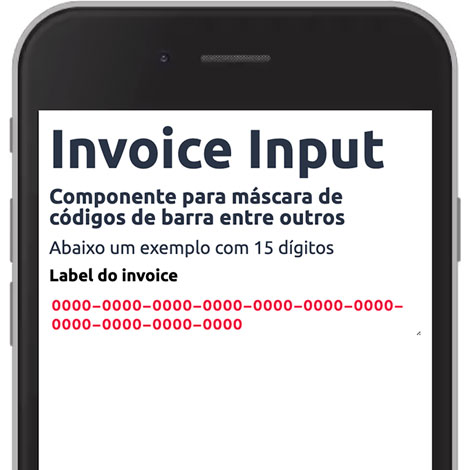
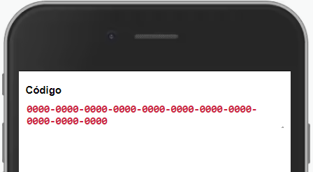

Componente para máscara de códigos de barra entre outros.



Modifique esse componente em tempo real pelo [Storybook](https://ame-miniapp-components.calindra.com.br/storybook/?path=/story/intera%C3%A7%C3%B5es-invoiceinput--basic)

## Utilização

```xml
<InvoiceInput
  placeholder='0000-0000-0000-0000-0000-0000-0000-0000-0000-0000-0000'
  separator='-'
  numberSeparator={4}
  maxlength={44}
  label='Label do invoice'
/>
```

## Propriedades

| Propriedade     | Descrição                                                                                                         | Type   | Default | Obrigatório |
|-----------------|-------------------------------------------------------------------------------------------------------------------|--------|---------|-------------|
| placeHolder     | Essa propriedade recebe uma string com o placeholder que irá aparecer no input.                                   | String | null    | não         |
| separator       | Propriedade para definir qual será o separador dos números                                                        | String | -       | não         |
| numberSeparator | Propriedade que define de quantos em quantos números deve aparecer o separador                                    | Number | 4       | não         |
| maxlength       | Propriedade que define qual o máximo de números que o input poderá receber, esse número não conta com o separador | Number | 16      | não         |
| label           | Propriedade que recebe uma string com o label que irá aparecer acima do input.                                    | String | null    | não         |

## Exemplos

Abaixo, alguns exemplos usando o InvoiceInput:



```xml
<Window>
  <InvoiceInput
    label='Código'
    dataCy='invoice-label'
    placeholder='0000-0000-0000-0000-0000-0000-0000-0000-0000-0000-0000'
    separator='-'
    numberSeparator={4}
    maxlength={44}
  />
<Window>
```

