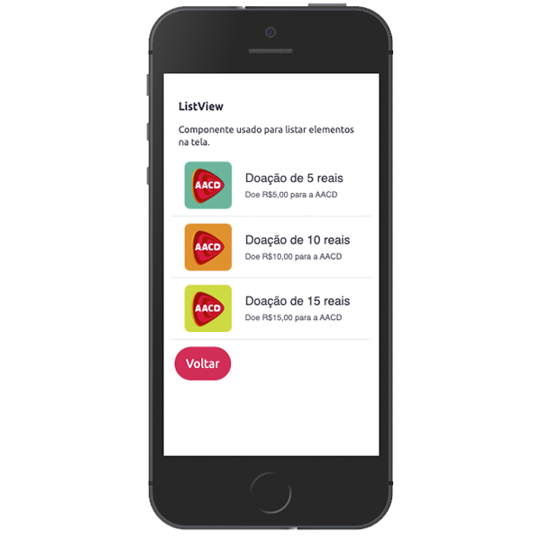
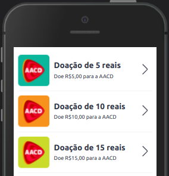
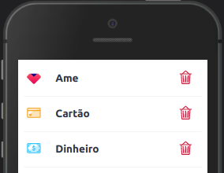

Este componente fornece uma lista útil para ser usada como um navegador, exibir produtos ou outras coisas.



<br>

## Modifique esse componente em tempo real pelo [Storybook](https://ame-miniapp-components.calindra.com.br/storybook/?path=/story/listas-listview--basic)

<br>

### Utilização

```jsx harmony
<ListView
  items={[
    {
      title: 'Título do Item (Opcional)',
      subtitle: 'Subtítulo (Opcional)',
      image: 'Path para Imagem (Opcional)'
    }
    //... Outros itens
  ]}
  onItemSelect={(item) => {
    this.handleItemSelected(item)
  }}
/>
```

## Propriedades

| Propriedade    | Descrição                                                                                                                                              | Type     | Default | Obrigatório |
| -------------- | ------------------------------------------------------------------------------------------------------------------------------------------------------ | -------- | ------- | ----------- |
| items          | Array de objetos contendo os itens apresentado na lista. Veja o que pode receber cada objeto [clicando aqui](#items).                                  | array    | null    | true        |
| onItemSelect   | Recebe uma função que é executada ao click, retornado o item clicado.                                                                                  | function | null    | true        |
| rightIcon      | Coloca um ícone a direita de cada item. Recebe: [tokens de icones](image.md#lista-de-ícones), endereço HTTPS, ou path local do icone (usando require). | function | null    | false       |
| rightIconColor | Seleciona uma cor para o icone. Recebe um dos seguintes [tokens](color.md).                                                                            | string   | null    | false       |
| rightIconClick | Recebe uma função para ser executada quando o icone a direta é clicado.                                                                                | function | null    | false       |

### items

Valores aceitos em cada objeto do array. Todos os valores são do tipo `string`.

```js
{
  key: "index do objeto"
  title: 'Titulo do item.',
  subtitle: 'Breve descrição do item.'
  image: 'HTTPS da imagem ou endereço da imagem local',
  icon: 'Token do ameIcon, endereço HTTPS da imagem do ícone ou endereço da imagem ícone local usando require.',
  iconColor: 'Cor do icon, podendo receber: black e red. Por padrão a cor é preto.',
}
```

## Exemplos

Exemplo de uma lista com imagem e icones a direita, alterando cor e recebendo o icone de um dos itens via require:



```jsx
state = {
  items: [
    {
      key: '0',
      title: 'Doação de 5 reais',
      subtitle: 'Doe R$5,00 para a AACD',
      image:
        'https://s3.amazonaws.com/images.dev.amedigital.com/ongs/aacd15.png'
    },
    {
      key: '1',
      title: 'Doação de 10 reais',
      subtitle: 'Doe R$10,00 para a AACD',
      image:
        'https://s3.amazonaws.com/images.dev.amedigital.com/ongs/aacdoutros.png'
    },
    {
      key: '2',
      title: 'Doação de 15 reais',
      subtitle: 'Doe R$15,00 para a AACD',
      image:
        'https://s3.amazonaws.com/images.dev.amedigital.com/ongs/aacd05.png'
    }
  ]
}
;<ListView
  items={this.state.items}
  rightIcon="right-next"
  rightIconClick={(item) => this.onIconClick(item)}
  onItemSelect={(e) => this.onClickItem(e)}
/>
```

---

Exemplo com icones a esquerda e a direita:



```jsx
state = {
  items2: [
    {
      key: '0',
      title: 'Ame',
      icon: require('../assets/images/logo-ame.png')
    },
    {
      key: '1',
      title: 'Cartão',
      icon: 'credit-card-ame',
      iconColor: 'categorycolor-waiting'
    },
    {
      key: '2',
      title: 'Dinheiro',
      icon: 'money-outline',
      iconColor: 'categorycolor-credit'
    }
  ]
}
;<ListView
  items={this.state.items2}
  rightIcon="trash-outline"
  rightIconColor="amecolor-primary-dark"
  onItemSelect={(e) => this.onClickItem(e)}
  rightIconClick={(item) => this.onIconClick(item)}
/>
```
