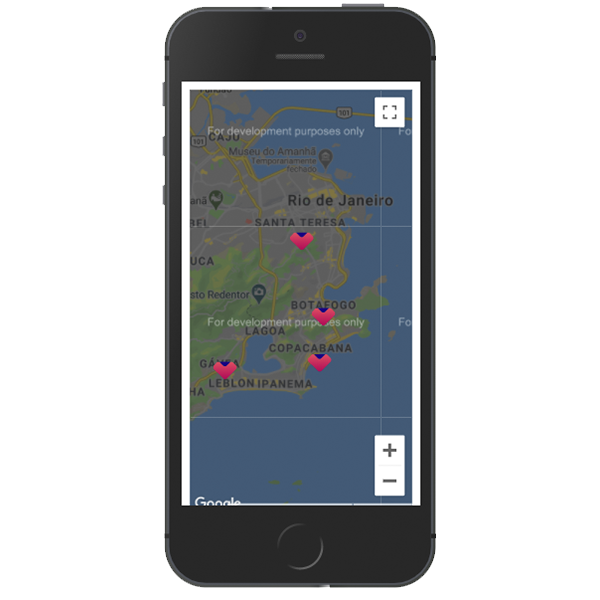

Componente utilizado para a exibir a localização no mapa, a partir da API do Google Map.

Documentação da API: https://developers.google.com/maps/documentation/javascript/overview

#### _Está tag é autofechável_

## Exemplo



<br>

## Modifique esse componente em tempo real pelo Storybook [clique aqui](https://ame-miniapp-components.calindra.com.br/storybook/?path=/story/intera%C3%A7%C3%B5es-map--basic)

<br>

## Utilização

<br>

```jsx harmony
<Map
  apiKey={'GOOGLE_API_KEY'}
  mapOptions={{
    center: {
      lat: -22.94980821,
      lng: -43.19095194,
    },
    zoom: 12,
  }}
  getMap={(map, markers) => {
    this.setState({ map, markers });
  }}
  onMarkerPress={marker => {
    let info = new window.google.maps.InfoWindow({
      content: 'teste',
    });
    info.open(this.state.map, marker);
  }}
  markers={[
    {
      lat: -22.970722,
      lng: -43.182365,
      options: {
        title: 'Copacabana',
        clickable: false,
        icon:
          'https://developers.google.com/maps/documentation/javascript/examples/full/images/parking_lot_maps.png',
      },
    },
    {
      lat: -22.9511,
      lng: -43.1809,
      options: {
        title: 'Botafogo',
        draggable: true,
      },
    },
  ]}
/>
```

<br>

## Propriedades

<br>

| Propriedade   | Descrição                                                                                                                                                                                                                                                        | Type     | Default | Obrigatório |
|---------------|------------------------------------------------------------------------------------------------------------------------------------------------------------------------------------------------------------------------------------------------------------------|----------|---------|-------------|
| apiKey        | Chave de Api **String** fornecida pelo Google para a exibição de um Mapa.                                                                                                                                                                                        | String   | null    | true        |
| mapOptions    | Aqui vão, obrigatoriamente em formato de objeto, todas as opções para a criação do mapa, como: center, zoom, disableDefaultUI...                                                                                                                                 | Object   | null    | false       |
| getMap        | Função a ser executada que recebe como parametro o mapa criado via props na construção do mapa. Use-a para armazenar o mapa em um estado para usa-lo se necessario no google map.                                                                                | Function | null    | false       |
| height        | Define a altura do mapa. As informações principai necessárias para a criação de um Marker são lat: (latitude) e lng: (longitude), porem, em options, você pode colocar todas as opções que desejar para o marker, como **title**, **clickable** e **draggable**. | Number   | 100vh   | false       |
| markers       | Lista de Pins no mapa.                                                                                                                                                                                                                                           | Array    | null    | false       |
| onMarkerPress | Ação de clique em cada marker. Recebe como parametro da função um objeto **marker**. Tem como valor o marker que está sendo pressionado, para ser utilizado em funções que o requeira.                                                                           | Function | null    | false       |


