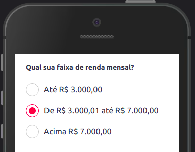
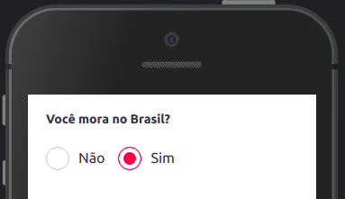

O Radio é usado para seleções únicas, onde somente uma opção pode ser selecionada


## Modifique esse componente em tempo real pelo [Storybook](https://ame-miniapp-components.calindra.com.br/storybook/?path=/story/intera%C3%A7%C3%B5es-radio--basic)

## Utilização

```xml
  <Radio
    onChange={e => {
      console.log(e);
    }}
    name='radio-teste'
    flex
    items={[
      {
        text: 'Sim',
        value: 'teste',
      },
      {
        text: 'Não',
        value: 'teste 1',
        checked: true,
      },
    ]}
  />
```

## Propriedades

| Propriedade | Descrição                                                                                                                                | Type     | Default | Obrigatório |
| ----------- | ---------------------------------------------------------------------------------------------------------------------------------------- | -------- | ------- | ----------- |
| name        | Essa propriedade define de qual grupo o radio faz parte.                                                                                 | string   | null    | true        |
| flex        | O flex permite que renderize um radio ao lado do outro, o recomendado é a utilização apenas com textos pequenos e no máximo duas opções. | boolean  | null    | false       |
| onChange    | Nessa função será retornado o value que foi selecionado pelo usuário.                                                                    | function | null    | true        |
| items       | No items será passado um array com os objetos que controlam os radios. As propriedades para o items estão abaixo.                        | array    | null    | true        |

### items

| Propriedade | Descrição                                                      | Type    | Default | Obrigatório |
| ----------- | -------------------------------------------------------------- | ------- | ------- | ----------- |
| text        | text é responsável pelo texto que será apresentado ao usuário. | string  | null    | true        |
| value       | O value recebe o valor que será devolvido na função onChange.  | string  | null    | true        |
| checked     | Quando true essa propriedade deixa o radio como checked.       | boolean | null    | false       |

### Exemplos

Exemplo com 3 opções:



```jsx harmony
<View>
  <Text fontSize="xxxs" lineHeight="medium" fontWeight="bold">
    Qual sua faixa de renda mensal?
  </Text>
  <Spacing size="xs" />
  <Radio
    name="monthly_income"
    items={[
      {
        text: 'Até R$ 3.000,00',
        value: '<3'
      },
      {
        text: 'De R$ 3.000,01 até R$ 8.000,00',
        value: '3-8',
        checked: true
      },
      {
        text: 'Acima R$ 8.000,00',
        value: '8>'
      }
    ]}
    onChange={(value) => {
      console.log(value)
    }}
  />
</View>
```

---

Exemplo com 2 opções e a propriedade `flex` aplicada.



```jsx
<View>
  <Text fontSize="xxxs" lineHeight="medium" fontWeight="bold">
    Você mora no Brasil?
  </Text>
  <Spacing size="xs" />
  <Radio
    flex
    name="brazil_resident"
    items={[
      {
        text: 'Não',
        value: 'no'
      },
      {
        text: 'Sim',
        value: 'yes',
        checked: true
      }
    ]}
    onChange={(value) => {
      console.log(value)
    }}
  />
</View>
```

---

No próximo exemplo está uma forma de recuperar uma informação escolhida pelo Radio e salva no [Storage](https://super-app-client.calindra.com.br/docs/ame-super-app-client/#storage) e recuperar para definir se alguma opção já comece como marcada.

```js
export default class RadioExemplo {
  constructor(props) {
    super(props)
    this.state = {
      userGender: ''
    }
    this.getUserGender()
  }

  handleUserGender = async (value) => {
    try {
      await Ame.storage.setItem(`userGender`, value)
    } catch (error) {
      console.log(error)
    }
  }

  getUserGender = async () => {
    let userGender = await Ame.storage.getItem('userGender')
    this.setState({ userGender: userGender })
  }
}
```

```jsx
<Radio
  name="user-gender"
  items={[
    {
      text: 'Feminino',
      value: 'feminino',
      checked: this.state.userGender === 'feminino'
    },
    {
      text: 'Masculino',
      value: 'masculino',
      checked: this.state.userGender === 'masculino'
    }
  ]}
  onChange={(e) => {
    this.handleUserGender(e)
  }}
/>
```

OBS: o propriedade `checked` pode receber também uma função que retorna **true** ou **false** para casos de verificações internadas.
