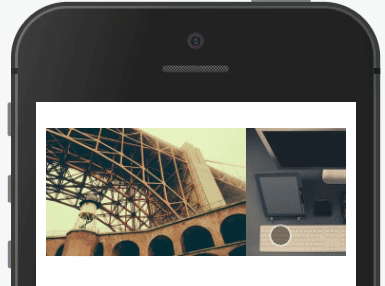
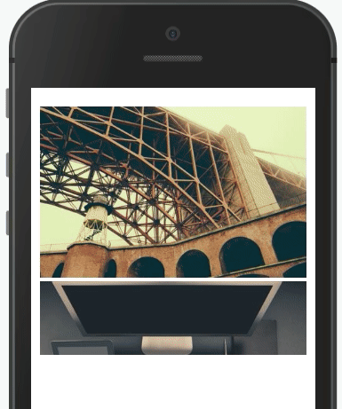

Use o componente ScrollView para mostrar o conteúdo quando for maior que a tela ou a área interna.
Você pode definir um atributo de direção de rolagem (vertical ou horizontal).

> O componente [**`ScrollView`**]() depende que o seu elemento pai possua altura definida, de forma que ele possa ajustar o conteúdo na tela. Caso o elemento pai não possua altura definida, o comportamento padrão do [**`ScrollView`**]() exibirá todo o conteúdo.


```jsx harmony
<ScrollView>
  <Image src="https://picsum.photos/seed/1/420/270" />
  <Image src="https://picsum.photos/seed/2/420/270" />
  <Image src="https://picsum.photos/seed/3/420/270" />
  <Image src="https://picsum.photos/seed/4/420/270" />
  <Image src="https://picsum.photos/seed/5/420/270" />
</ScrollView>
```

<br>

## Modifique esse componente em tempo real pelo Storybook [clique aqui](https://ame-miniapp-components.calindra.com.br/storybook/?path=/story/organiza%C3%A7%C3%A3o-scrollview--basic)

<br>

| Propriedade | Descrição                                                                            | Type             | Default | Obrgatório |
| ----------- | ------------------------------------------------------------------------------------ | ---------------- | ------- | ---------- |
| horizontal  | Altera a disposição da View para horizontal. O padrão é vertical.                    | boolean          | false   | não        |
| snap        | O atributo introduz posições de snap de rolagem, move o conteúdo por sua totalidade. | boolean          | false   | não        |
| hideScroll  | Esconde a barra de scroll.                                                           | boolean          | false   | não        |
| itemsWidth  | Largura dos itens dentro do scrollview, valor único.                                 | string ou number | 100%    | não        |
| scrollTo    | Realiza Scroll até o elemento da lista de index igual o passado na propriedade.      | number           | null    | não        |

## Exemplos

No seguinte exemplo o ScrollView é usado na forma horizontal com algumas imagens e cada imagem com 200px de largura:



```jsx harmony
<View>
  <ScrollView horizontal hideScroll itemsWidth={200}>
    <Image src={'https://picsum.photos/seed/1/420/270'} alt="picsum-1" />
    <Image src={'https://picsum.photos/seed/2/420/270'} alt="picsum-2" />
    <Image src={'https://picsum.photos/seed/3/420/270'} alt="picsum-3" />
    <Image src={'https://picsum.photos/seed/4/420/270'} alt="picsum-4" />
  </ScrollView>
</View>
```

---

Nesse exemplo o ScrollView é usado na vertical com a propriedade snap e com as imagens ocupando 100% da largura:



```jsx
<View height="300px">
  <ScrollView snap hideScroll>
    <Image src={'https://picsum.photos/seed/1/420/270'} alt="picsum-1" />
    <Image src={'https://picsum.photos/seed/2/420/270'} alt="picsum-2" />
    <Image src={'https://picsum.photos/seed/3/420/270'} alt="picsum-3" />
    <Image src={'https://picsum.photos/seed/4/420/270'} alt="picsum-4" />
    <Image src={'https://picsum.photos/seed/5/420/270'} alt="picsum-5" />
  </ScrollView>
</View>
```

---
