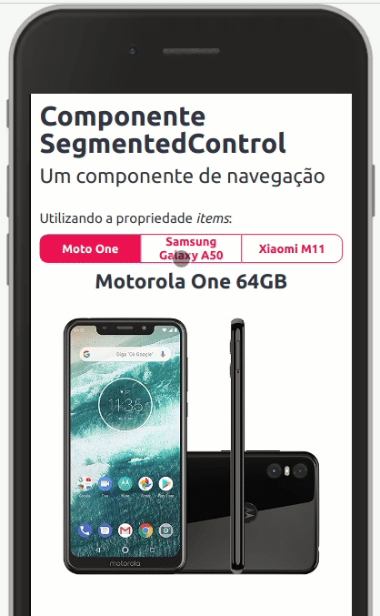
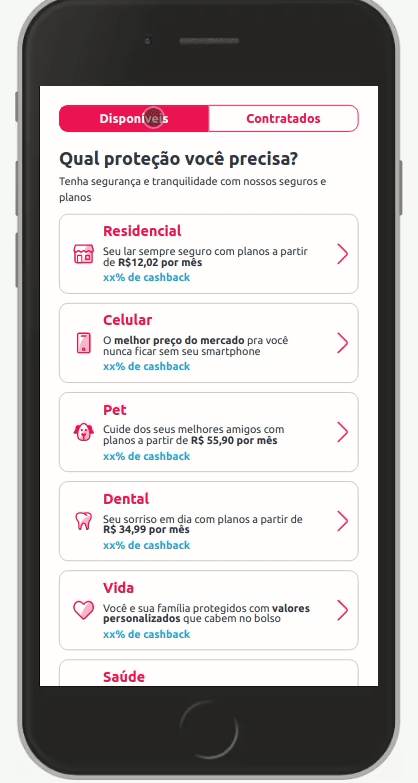

Utilizado sempre para a navegação. Os itens serão transformados em abas.

## Exemplo



<br>

## Modifique esse componente em tempo real pelo Storybook [clique aqui](https://ame-miniapp-components.calindra.com.br/storybook/?path=/story/intera%C3%A7%C3%B5es-segmentedcontrol--basic)

<br>

## Utilização

Há duas formas de se utilizar o componente SegmentedControl:

1. Atribuindo uma propriedade **items** no componente, passando um array de objetos.

```jsx harmony
<SegmentedControl
  items={[
    {
      title: "Moto One",
      content: (
        <View direction="column" align="center">
          <Header textAlign="center">Motorola One 64GB</Header>
          <Spacing size="md" />
          <Image
            width="300px"
            src="https://images-americanas.b2w.io/produtos/01/00/offers/01/00/item/134163/7/134163729_1GG.jpg"
          />
        </View>
      ),
    },
    {
      title: "Samsung Galaxy A50",
      content: (
        <View direction="column" align="center">
          <Header textAlign="center">Samsung Galaxy A50</Header>
          <Spacing size="md" />
          <Image
            width="300px"
            src="https://www.araexpress.am/media/image/13656/samsung-galaxy-a50-64gb.jpg"
          />
        </View>
      ),
    },
    {
      title: "Xiaomi M11",
      content: (
        <View direction="column" align="center">
          <Header textAlign="center">Xiaomi M11</Header>
          <Spacing size="md" />
          <Image
            width="300px"
            src="https://cdn.dxomark.com/wp-content/uploads/drafts/post-92345/Xiaomi-Mi-11-Pro-featured-image-packshot-review-Recovered.jpg"
          />
        </View>
      ),
    },
  ]}
  defaultActiveTab={0}
/>
```

## Propriedades

| Propriedade      | Descrição                                                                                                                                   | Type     | Default |
| ---------------- | ------------------------------------------------------------------------------------------------------------------------------------------- | -------- | ------- |
| items            | Array de objetos que contem um título que recebe `string` e o conteudo que recebe os componentes rederizados no corpo do `SegmentedControl` | array    | null    |
| onActiveTab      | Função que retorna o index da tab ativa.                                                                                                    | function | null    |
| defaultActiveTab | Esta propriedade seta como default o index do item selecionado.                                                                             | number   | null    |
| disabled         | Desabilita a interação com o componente                                                                                                     | boolean  | null    |

### Deprecated

| Propriedade      | Descrição                                                       | Type   | Default |
| ---------------- | --------------------------------------------------------------- | ------ | ------- |
| defaultTabActive | Esta propriedade seta como default o index do item selecionado. | number | null    |

2. Utilizando o componente filho **SegmentedControl.Item** e dentro dele colocar as informações que deseja.

Nesse caso o conteudo é informado como `children` do **SegmentedControl.Item** e o `title`é passado como uma prop do mesmo.

O mesmo exemplo utilizando o **SegmentedControl.Item**:

```jsx harmony
<SegmentedControl onActiveTab={(i) => console.log(i)} defaultActiveTab={0}>
  <SegmentedControl.Item title="Moto G8 Plus">
    <View direction="column" align="center">
      <Header textAlign="center">Motorola One 64GB</Header>
      <Spacing size="md" />
      <Image
        width="300px"
        src="https://images-americanas.b2w.io/produtos/01/00/offers/01/00/item/134163/7/134163729_1GG.jpg"
      />
    </View>
  </SegmentedControl.Item>
  <SegmentedControl.Item title="Samsung Galaxy A50">
    <View direction="column" align="center">
      <Header textAlign="center">Samsung Galaxy A50</Header>
      <Spacing size="md" />
      <Image
        width="300px"
        src="https://www.araexpress.am/media/image/13656/samsung-galaxy-a50-64gb.jpg"
      />
    </View>
  </SegmentedControl.Item>
  <SegmentedControl.Item title="Xiaomi M11">
    <View direction="column" align="center">
      <Header textAlign="center">Xiaomi M11</Header>
      <Spacing size="md" />
      <Image
        width="300px"
        src="https://cdn.dxomark.com/wp-content/uploads/drafts/post-92345/Xiaomi-Mi-11-Pro-featured-image-packshot-review-Recovered.jpg"
      />
    </View>
  </SegmentedControl.Item>
</SegmentedControl>
```

## Limites

**_Deprecated_**

> Em versões futuras o máximo de itens deixará de ser 4 e passará a ser 3!

A quantidade máxima de itens deve ficar entre 2 e 4 itens.
Sendo passado número de itens inferior a 2 ou superior a 4 o componente não é exibido.

## Exemplo

Um exemplo de uso mais completo do **SegmentedControl**:



```jsx harmony

const options = [
  {
    title: 'Residencial',
    description:
      'Seu lar sempre seguro com planos a partir de [b]R$12,02 por mês[/b]',
    subdescription: 'xx% de cashback',
    rightIcon: 'right-next',
    rightIconColor: 'red',
    leftIcon: 'house-outline',
    leftIconColor: 'red'
  },
  {
    title: 'Celular',
    description:
      'O [b]melhor preço do mercado[/b] pra você nunca ficar sem seu smartphone ',
    subdescription: 'xx% de cashback',
    rightIcon: 'right-next',
    rightIconColor: 'red',
    leftIcon: 'mobile-outline',
    leftIconColor: 'red'
  },
  {
    title: 'Pet',
    description:
      'Cuide dos seus melhores amigos com planos a partir de [b]R$ 55,90 por mês[/b]',
    subdescription: 'xx% de cashback',
    rightIcon: 'right-next',
    rightIconColor: 'red',
    leftIcon: 'pets-outline',
    leftIconColor: 'red'
  },
  {
    title: 'Dental',
    description:
      'Seu sorriso em dia com planos a partir de [b]R$ 34,99 por mês[/b]',
    subdescription: 'xx% de cashback',
    rightIcon: 'right-next',
    rightIconColor: 'red',
    leftIcon: 'wdental',
    leftIconColor: 'red'
  },
  {
    title: 'Vida',
    description:
      'Você e sua família protegidos com [b]valores personalizados[/b] que cabem no bolso',
    subdescription: 'xx% de cashback',
    rightIcon: 'right-next',
    rightIconColor: 'red',
    leftIcon: 'heart-outline',
    leftIconColor: 'red'
  },
  {
    title: 'Saúde',
    description:
      'Consultas e exames com planos a partir de [b]R$ xxx,xx por mês[/b]',
    subdescription: 'xx% de cashback',
    rightIcon: 'right-next',
    rightIconColor: 'red',
    leftIcon: 'drconsulta',
    leftIconColor: 'red'
  }
]

<SegmentedControl defaultActiveTab={0}>
  <SegmentedControl.Item title="Disponíveis">
    <View padding="none" paddingY="xxs">
      <Text fontSize="xs" fontWeight="bold">
        Qual proteção você precisa?
      </Text>
      <View padding="none" />
      <Text fontSize="micro" lineHeight="tight">
        Tenha segurança e tranquilidade com nossos seguros e planos{' '}
      </Text>
      <Spacing size="xxxs" />
      {options.map((card, index) => (
        <>
          <Card
            key={index}
            title={card.title}
            description={card.description}
            subdescription={card.subdescription}
            rightIcon={card.rightIcon}
            rightIconColor={card.rightIconColor}
            leftIcon={card.leftIcon}
            leftIconColor={card.leftIconColor}
          />
          <Spacing />
        </>
      ))}
      <View
        padding="none"
        paddingY="lg"
        direction="column"
        justify="center"
        align="center"
      >
        <Text color="neutralcolor-dark">Ainda com dúvidas?</Text>
        <Spacing size="xxs" />
        <Button
          type="secondary"
          label="Veja nossa central de ajuda"
          onClick={() => console.log('central de ajuda')}
        />
      </View>
    </View>
  </SegmentedControl.Item>
  <SegmentedControl.Item title="Contratados">
    <View padding="none" paddingY="xxs">
      <View
        direction="row"
        align="center"
        padding="none"
        justify="between"
      >
        <Text fontSize="xs" fontWeight="bold">
          Meus seguros e planos
        </Text>
        <TextLink
          text="Ajuda"
          onClick={() => console.log('Ajuda')}
          leftIcon="help-outline"
        />
      </View>
      <ExpandableCard>
        <ExpandableCard.Item titleIcon="wdental" title="Dental">
          <View padding="none" paddingY="sm">
            <Paragraph>[b]Status:[/b] Contratado</Paragraph>
            <Paragraph>
              [b]Data de início do contrato:[/b] 88/88/88
            </Paragraph>
            <Paragraph>[b]Parceiro:[/b] W Dental</Paragraph>
          </View>
          <Paragraph>
            [b]Usar seguro:[/b]
            [color=amecolor-primary-medium]0800-888-888[/color]
          </Paragraph>
          <Spacing size="xxs" />
          <View padding="none" direction="row">
            <Button
              type="secondary"
              label="Cancelar Seguro"
              onClick={() => console.log('Cancelar')}
            />
            <Spacing horizontal size="xs" />
            <Button
              type="secondary"
              label="Carterinha digital"
              onClick={() => console.log('Carterinha')}
            />
          </View>
        </ExpandableCard.Item>
        <ExpandableCard.Item titleIcon="heart-outline" title="Vida">
          <View padding="none" paddingY="sm">
            <Paragraph>[b]Status:[/b] Contratado</Paragraph>
            <Paragraph>
              [b]Data de início do contrato:[/b] 88/88/88
            </Paragraph>
            <Paragraph>[b]Parceiro:[/b] Metlife</Paragraph>
          </View>
          <Paragraph>
            [b]Usar seguro:[/b]
            [color=amecolor-primary-medium]0800-888-888[/color]
          </Paragraph>
          <Spacing size="xxs" />
          <View padding="none" direction="row">
            <Button
              type="secondary"
              label="Cancelar Seguro"
              onClick={() => console.log('Cancelar')}
            />
            <Spacing horizontal size="xs" />
            <Button
              type="secondary"
              label="Carterinha digital"
              onClick={() => console.log('Carterinha')}
            />
          </View>
        </ExpandableCard.Item>
      </ExpandableCard>
    </View>
  </SegmentedControl.Item>
</SegmentedControl>
```
