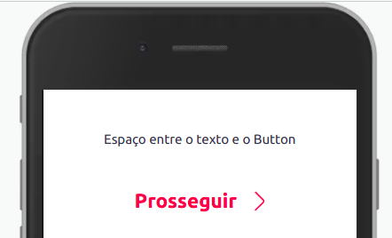
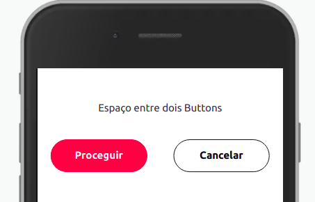

Componente que insere um espaço entre outros componentes.



## Modifique esse componente em tempo real pelo [Storybook](https://ame-miniapp-components.calindra.com.br/storybook/?path=/story/componentes-simples-spacing--basic)

## Utilização

```xml
<View>
  <Paragraph textAlign='center'>Espaço entre o texto e o Button</Paragraph>
  <Spacing size='lg' />
  <Button
    dataCy='quaternaryButtonDisabled'
    label='Prosseguir'
    type='quaternary'
    onClick={() => console.log('Componente Button')}
  />
</View>
```

## Propriedades

| Propriedade | Descrição                                                                         | Type   | Default |
|-------------|-----------------------------------------------------------------------------------|--------|---------|
| size        | Propriedade que define o tamanho do espaçamento na vertical entre os componentes. | string | xxxs    |
| horizontal  | Propriedade que muda a orientação do espaçamento para horizontal.                 | string | xxxs    |

Abaixo segue uma lista dos valores de espaçamento para a propriedade **size**, do menor para o maior.

- None: `none` = 0px
- Quarck: `quarck` = 1px
- Nano: `nano` = 5px
- Extra extra extra small: `xxxs` = 10px
- Extra extra small: `xxs` = 15px
- Extra small: `xs` = 20px
- Small: `sm` = 25px
- Medium: `md` = 30px
- Large: `lg` = 40px
- Extra large: `xl` = 80px
- Double extra large: `xxl` = 100px
- Triple extra large: `xxxl` = 120px
- Display: `display` = 140px
- Giant: `giant` = 160px

```xml
<Spacing size='nano' />
```

## Exemplos

Abaixo, exemplo do Spacing com a prop `horizontal`:



```xml
<View>
  <Paragraph textAlign='center'>Espaço entre dois Buttons</Paragraph>
  <Spacing size='lg' />

  <View padding='none' direction='row' align='center'>
    <Button
      label='Proceguir'
      type='primary'
      onClick={() => console.log('Componente Button')}
    />
    <Spacing horizontal size='lg' />
    <Button
      label='Cancelar'
      type='secondary'
      onClick={() => console.log('Componente Button')}
    />
  </View>
</View>
```
