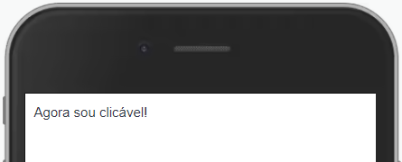
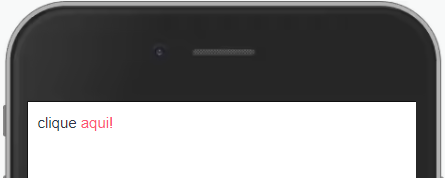

Envolva um componente com Touchable para que ele passe a ter interação.



Modifique esse componente em tempo real pelo Storybook [clique aqui](https://ame-miniapp-storybook.calindra.com.br/mobile/v2/?path=/story/intera%C3%A7%C3%B5es-touchable--basic)

## Utilização

```xml
<Touchable onClick={() => {console.log('Clicado!')}}>
  <Text>Agora sou clicável</Text>
</Touchable>
```
## Propriedades


| Propriedade     | Descrição                                                     | Type     | Default | Obrigatório |
|-----------------|---------------------------------------------------------------|----------|---------|-------------|
| onClick         | Função que será chamada ao tocar no componente.               | Function | null    | sim         |
| disabledOnClick | Função que será chamada caso o Touchable esteja desabilitado. | Function | null    | não         |
| disabled        | Desabilita o toque.                                           | Boolean  | false   | não         |

## Exemplos

Abaixo, alguns exemplos usando o Touchable:



```xml
<View>
  <Text>clique </Text>
  <Touchable onClick={console.log('clicado!')}>
    <Text color='amecolor-primary-light'>aqui!</Text>
  </Touchable>
</View>
```

