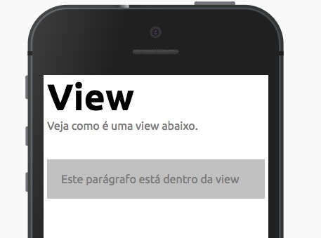
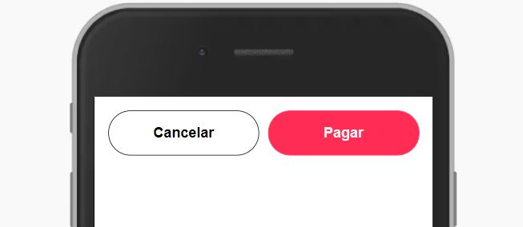
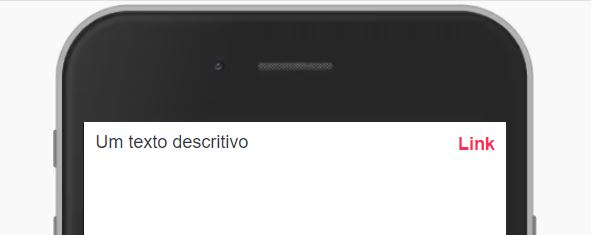
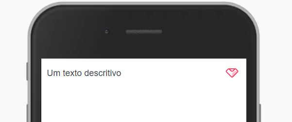

Talvez um dos componentes mais úteis para construir telas e recebe diversas propriedades para te ajudar nessa tarefa.



Modifique esse componente em tempo real pelo [Storybook](https://ame-miniapp-components.calindra.com.br/storybook/?path=/story/componentes-simples-view--basic)

## Utilização

```xml
<View>
  <Paragraph>
    Este parágrafo está dentro da view
  </Paragraph>
</View>
```

## Propriedades

| Propriedade             | Descrição                                                                                                                                 | Type    | Default |
|-------------------------|-------------------------------------------------------------------------------------------------------------------------------------------|---------|---------|
| background              | Adiciona uma cor de fundo, [veja os valores](color.md)                                                                                    | string  | null    |
| border                  | Adiciona uma borda na View, [veja os valores](border.md)                                                                                  | string  | null    |
| borderRadius            | Define o arredondamento da borda, [veja os valores](border.md)                                                                            | string  | null    |
| borderRadiusLeftTop     | Define o arredondamento da borda no canto esquerdo superior, [veja os valores](border.md)                                                 | string  | null    |
| borderRadiusRightTop    | Define o arredondamento da borda no canto direito superior, [veja os valores](border.md)                                                  | string  | null    |
| borderRadiusLeftBottom  | Define o arredondamento da borda no canto esquerdo inferior, [veja os valores](border.md)                                                 | string  | null    |
| borderRadiusRightBottom | Define o arredondamento da borda no canto direito inferior, [veja os valores](border.md)                                                  | string  | null    |
| borderColor             | Define qual será a cor da borda, [veja os valores](color.md)                                                                              | string  | null    |
| direction               | Define qual será a direção do display flex, [veja os valores](flex.md)                                                                    | string  | null    |
| align                   | Define qual será o alinhamento vertical do display flex, [veja os valores](flex.md)                                                       | string  | null    |
| justify                 | Define qual sera o alinhamento horizontal do display flex, [veja os valores](flex.md)                                                     | string  | null    |
| paddingLeft             | Define o padding no lado esquerdo, [veja os valores](space.md)                                                                            | string  | xxxs    |
| paddingRight            | Define o padding no lado direito, [veja os valores](space.md)                                                                             | string  | xxxs    |
| paddingTop              | Define o padding em cima, [veja os valores](space.md)                                                                                     | string  | xxxs    |
| paddingBottom           | Define o padding em baixo, [veja os valores](space.md)                                                                                    | string  | xxxs    |
| paddingX                | Define o padding no eixo X, [veja os valores](space.md)                                                                                   | string  | null    |
| paddingY                | Define o padding no eixo Y, [veja os valores](space.md)                                                                                   | string  | null    |
| margin                  | Define a margem no eixo X e Y, [veja os valores](space.md)                                                                                | string  | null    |
| marginLeft              | Define a margem no lado esquerdo, [veja os valores](space.md)                                                                             | string  | null    |
| marginRight             | Define a margem no lado direito, [veja os valores](space.md)                                                                              | string  | null    |
| marginTop               | Define a margem em cima, [veja os valores](space.md)                                                                                      | string  | null    |
| marginBottom            | Define a margem em baixo, [veja os valores](space.md)                                                                                     | string  | null    |
| marginY                 | Define a margem no eixo Y, [veja os valores](space.md)                                                                                    | string  | null    |
| marginX                 | Define a margem no eixo X, [veja os valores](space.md)                                                                                    | string  | null    |
| width                   | Define qual será a largura da View em % ou px                                                                                             | string  | 100%    |
| height                  | Define qual será a altura da View em % ou px                                                                                              | string  | auto    |
| display                 | Define qual será o display e os valores aceitos são 'flex', 'block', 'none'                                                               | string  | block   |
| flexWrap                | Define se os itens são forçados em uma linha ou podem ser agrupados em várias linhas e os valores aceitos são 'wrap', 'nowrap', 'reverse' | string  | null    |
| flexNone                | Passando essa propriedade a View respeitará o tamanho de width independente do flex                                                       | boolean | false   |
| opacity                 | Define a opacidade da View, [veja os valores](opacity.md)                                                                                 | string  | null    |

### Deprecated

| Propriedade | Descrição                                                 | Type   | Default |
|-------------|-----------------------------------------------------------|--------|---------|
| squish      | Essa propriedade foi substituída pela propriedade padding | string | null    |
| inset       | Essa propriedade foi substituída pela propriedade margin  | string | null    |
| visibility  | Para esconder uma view, use o display='none'              | string | null    |

## Exemplos

Abaixo usamos a View para construir um exemplo de action com o botão de cancelar e um botão pagar na mesma linha, usando o flex



```xml
  <View display='flex'>
    <View padding='nano' textAlign='center'>
      <Button
        label={'Cancelar'}
        type='secondary'
        onClick={() => console.log('Cancelar')}
      />
    </View>
    <View padding='nano'>
      <Button
        label={'Pagar'}
        type='primary'
        onClick={() => console.log('Pagar')}
      />
    </View>
  </View>
```

---

Abaixo usamos a View para construir um exemplo de action com o botão de cancelar e um botão pagar na mesma linha, usando o flex



```xml
  <View display='flex' padding='none'>
    <View>
      <Paragraph>Um texto descritivo</Paragraph>
    </View>
    <View textAlign='right'>
      <TextLink
        text='Link'
        onClick={() => {
          console.log('click');
        }}
      />
    </View>
  </View>
```

---

Nesse outro exemplo, fizemos quase a mesma coisa que acima, porém utilizando um ícone e alinhamos os elementos utilizando apenas as propriedades de flex



```xml
  <View display='flex' padding='none' align='center'>
    <View>
      <Paragraph>Um texto descritivo</Paragraph>
    </View>
    <View justify='end'>
      <AmeIcon
        icon='ame-outline'
        color='red'
        onClick={() => {
          console.log('click');
        }}
      />
    </View>
  </View>
```

---

Conseguimos construir coisas mais complexas como um card personalizado utilizando apenas as propriedades da View junto com outros componentes


```xml
<View padding='none' border='hairline' borderRadius='md'>
  <View>
    <Illustration
      height={340}
      image={require('../assets/images/ilustra-1.png')}
    />
  </View>
  <View textAlign='center'>
    <Paragraph>
      Um texto descritivo explicando qual ação será realizada pelo botão
    </Paragraph>
  </View>
  <View justify='center'>
    <View width='250px'>
      <Button
        label='Aplicar'
        onClick={() => {
          console.log('click');
        }}
      />
    </View>
  </View>
</View>
```

---

Abaixo temos um exemplo de card com botão de ação na parte inferior do card


```xml
  <View padding='none' border='hairline' borderRadius='md'>
    <View>
      <Illustration
        height={340}
        image={require('../assets/images/ilustra-1.png')}
      />
    </View>
    <View textAlign='center'>
      <Paragraph>
        Um texto descritivo explicando qual ação será realizada pelo botão
      </Paragraph>
    </View>
    <Divisor line />
    <View display='flex' padding='none' align='center'>
      <View>
        <Paragraph>Um texto descritivo</Paragraph>
      </View>
      <View justify='end' paddingY='xs'>
        <TextLink
          text='Ação'
          onClick={() => {
            console.log('click');
          }}
        />
      </View>
    </View>
  </View>
```
