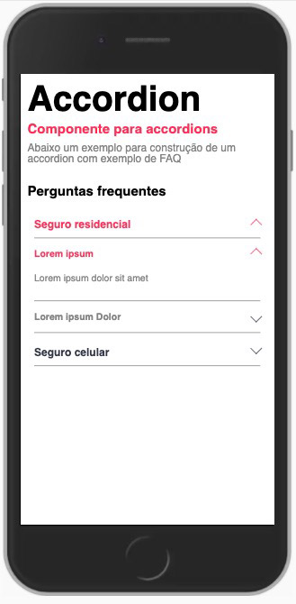
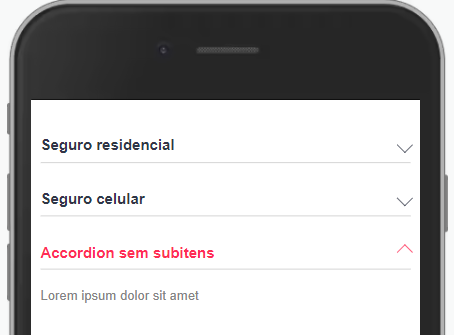
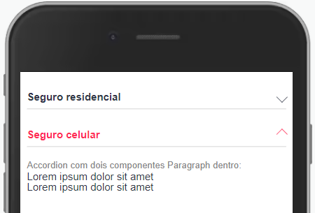

Componente accordion para exibição de textos no estilo FAQ.



Modifique esse componente em tempo real pelo [Storybook](https://ame-miniapp-components.calindra.com.br/storybook/?path=/story/intera%C3%A7%C3%B5es-accordion--basic)

## Utilização

Há duas formas de se utilizar o componente Accordion:

1. Atribuindo uma propriedade **data** no componente, passando um array de objetos.
2. Utilizando o componente filho Accordion.Card e dentro dele colocar as informações que deseja.

## Propriedades

| Propriedade    | Descrição                                                                                              | Type     | Default | Obrigatório |
| -------------- | ------------------------------------------------------------------------------------------------------ | -------- | ------- | ----------- |
| data           | Array que define os itens do Accordion                                                                 | Array    | null    | false       |
| Accordion.Card | Não é de fato uma propriedade mas sim uma props.children que pode ser utilizado com o .map por exemplo | Children | null    | false       |
| title          | Título exibido no Accordion quando ultilizado o Accordion.Card                                         | String   | null    | true        |

## Exemplos

Abaixo, alguns exemplos usando o Accordion:

### Utilizando a propriedade data

### OBS: Abaixo como está o objeto accordionData:

```xml
  state = {
    accordionData: [
      {
        title: 'Seguro residencial',
        items: [
          { title: 'Lorem ipsum', content: 'Lorem ipsum dolor sit amet' },
          { title: 'Lorem ipsum Dolor', content: 'Lorem ipsum dolor sit amet' },
        ],
      },
      {
        title: 'Seguro celular',
        items: [
          { title: 'Lorem ipsum', content: 'Lorem ipsum dolor sit amet' },
          { title: 'Lorem ipsum Dolor', content: 'Lorem ipsum dolor sit amet' },
        ],
      },
      {
        title: 'Accordion sem subitens',
        content: 'Lorem ipsum dolor sit amet',
      },
    ],
  };
```

Perceba que o último item do objeto não tem items e que ele contém o content, esse caso é para quando não existem aberturas do accordion internas e renderizará da seguinte maneira:



O item aberto não possuí subitens.

```xml
<Accordion data={this.state.accordionData} />
```

<br>

### Utilizando Accordion.Card



```xml
  <Accordion>
    <Accordion.Card title={'Seguro residencial'}>
      <Text>Lorem ipsum dolor sit amet</Text>
    </Accordion.Card>

    <Accordion.Card title={'Seguro celular'}>
      Accordion com dois componentes Text dentro:
      <Text>Lorem ipsum dolor sit amet</Text>
      <Text>Lorem ipsum dolor sit amet</Text>
    </Accordion.Card>
  </Accordion>
```

Nesta usabilidade deverá chamar o componente Accordion como pai, e dentro dele, para cada opção no Accordion, utilizar o Accordion.Card com a propriedade **title**, que será o título exibido no card, e dentro do Accordion.Card escrever o seu JSX. Você pode colocar esse trecho dentro de um .map e renderizar os cards com os objetos vindos de uma API.
