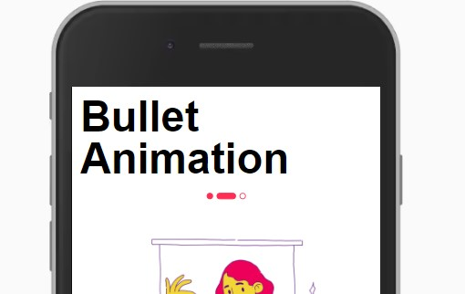

Componente para visualização de transição de elementos/telas através de bullets animados.



Modifique esse componente em tempo real pelo [Storybook](https://ame-miniapp-components.calindra.com.br/storybook/?path=/story/intera%C3%A7%C3%B5es-bulletanimation--basic)

## Utilização

```xml
<View>
   <Bullet
      returnSelected={index => console.log(index)}
      bullets={this.state.bullets}
      selected={this.state.selected}
    />
</View>
```

## Propriedades

| Propriedade    | Descrição                                                    | Type     | Default | Obrigatório |
| -------------- | ------------------------------------------------------------ | -------- | ------- | ----------- |
| bullets        | Define quantos bullets irão aparecer                         | number   | 3       | Sim         |
| returnSelected | Retorna qual o bullet ativo                                  | function | null    | Não         |
| selected       | Define qual é o bullet default na renderização do componente | number   | 1       | Não         |
