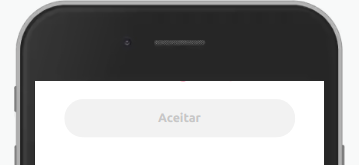

Exibe um botão na tela.
Nesta versão temos apenas um Componente **Button** para trabalhar.

## Exemplo


<br>

## Modifique esse componente em tempo real pelo [Storybook](https://ame-miniapp-components.calindra.com.br/storybook/?path=/story/intera%C3%A7%C3%B5es-button--primary)

<br>

## Utilização

```xml
<Window>
 <Button
label={'Pagar'}
type='primary'
onClick={() => console.log('Componente Button')}
/>
</Window>
```

## Propriedades

| Propriedade | Descrição                                                                                   | Type     | Default |
| ----------- | ------------------------------------------------------------------------------------------- | -------- | ------- |
| type        | Define o tipo do botão. Existe 3 opções: 'primary', 'secondary', 'tertiary' e 'quartenary'. | string   | primary |
| label       | Adiciona texto descritivo dentro do Button.                                                 | string   | null    |
| onClick     | Recebe uma função para ser executada ao torcarmos no botão.                                 | function | null    |
| disabled    | Desabilita o componente.                                                                    | boolean  | false   |

**OBS:** Caso o type escolhido for `tertiary`, existem mais duas propriedades que podem ser passadas.

| Propriedade | Descrição                              | Type   | Default |
| ----------- | -------------------------------------- | ------ | ------- |
| leftIcon    | Adiciona um icone a esquerda da label. | string | null    |
| rightIcon   | Adiciona um icone a direita da label.  | string | null    |

## Exemplos

Abaixo, alguns exemplos usando o Button:



```xml
 <Button type='primary' label='Aceitar' disabled />
```

---


```xml
<View>
  <Button label='Prosseguir' type='primary' />
  <Spacing />
  <Button label='Cancelar' type='secondary' />
</View>
```

---


```xml
<View
  borderRadius='sm'
  borderColor='amecolor-primary-medium'
  border='hairline'
  direction='row'
  align='center'
  padding='nano'>
  <Paragraph fontWeight='bold' color='neutracolor-brand-darkest'>
    Amanda Nunes
  </Paragraph>
  <Button
    type='tertiary'
    label='Editar contato'
    rightIcon='edit-outline'
    onClick={this.handleEditContact}
  />
</View>
```
