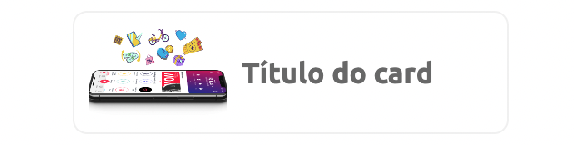

CardImage é um componente que contêm um conteúdo e ações sobre um determinado assunto.


<br>

Modifique esse componente em tempo real pelo Storybook [clique aqui](https://ame-miniapp-components.calindra.com.br/storybook/?path=/story/cards-card--basic)

<br>

## Utilização

```xml harmony

import ImageExample from '../assets/images/ame-example.png';

 <CardImage
    onPress={() => console.log('press')}
    image={ImageExample}
    title='Título do card'
    description='Informações adicionais do card'
  />
```

## Propriedades

| Propriedade | Descrição                                                                             | Type     | Default | Obrigatório |
| ----------- | ------------------------------------------------------------------------------------- | -------- | ------- | ----------- |
| title       | Título do card.                                                                       | string   | null    | Sim         |
| description | Pequeno texto desctritivo do card.                                                    | string   | null    | Não         |
| image       | Imagem que será exibida no card. Pode ser um endereço HTTPS ou path do arquivo local. | string   | null    | Sim         |
| onPress     | Função executada ao clicar no card.                                                   | function | null    | Não         |
| disabled    | Desabilita o componente.                                                              | boolean  | null    | Não         |

## Exemplos

Abaixo, alguns exemplos usando o Card:



```jsx harmony
<Window>
  <CardImage
    onPress={() => console.log('press')}
    image="https://s3.amazonaws.com/images.amedigital.com/site-ame/2021/6/O_Super_App_com_tudo_que_voce_precisa_7aaabde05b.png"
    title="Título do card"
  />
</Window>
```
