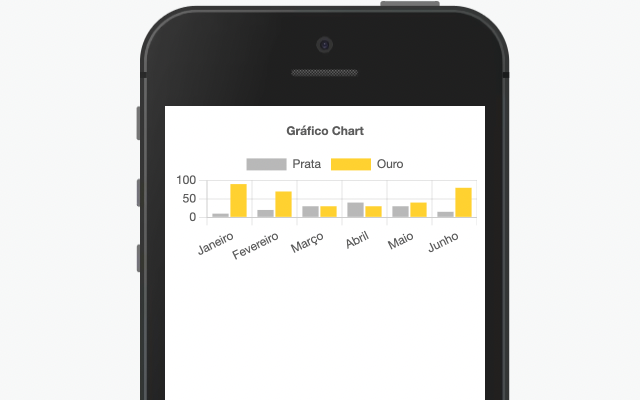
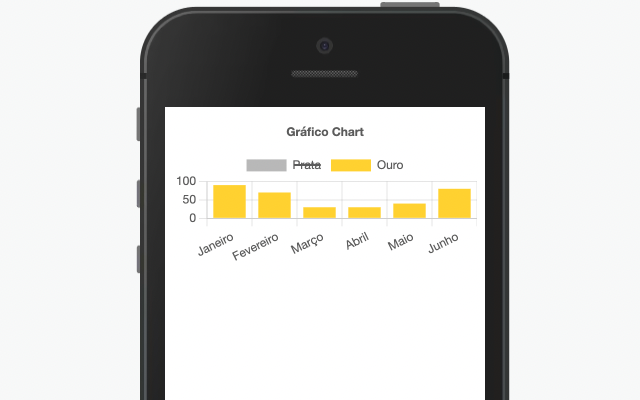

Componente Chart.Bar que permite que a exibição de gráficos no sistema.

## Componente Chart.Bar.



Utilizado para a exibição de de gráficos contendo sub-componentes do tipo: Bar, Line ou Pie.

## Utilização

```xml
 state = {
       labels: ['Janeiro', 'Fevereiro', 'Março','Abril', 'Maio', 'Junho'],
       dataOptions:[
        {
            label:"Prata",
            data: [10, 20, 30, 40, 30, 15],
            color: '#c0c0c0',
          },
          {
            label:"Ouro",
            data: [90, 70, 30, 30, 40, 80],
            color :'#ffd700'
          },
       ],
    }
 <Chart.Bar
     data={this.state.dataOptions}
     labels={this.state.labels}
     title="Gráfico em Barra"
  />
```

## Propriedades

| Propriedade | Descrição                                                                     | Type      | Default | Obrigatório |
| ----------- | ----------------------------------------------------------------------------- | --------- | ------- | ----------- |
| labels      | Array de textos que conceberão as propriedades do gráfico .                   | String[]  | null    | sim         |
| data        | Array do tipo DataBar que vai definir os valores, cores das barras do gráfico | DataBar[] | null    | sim         |
| title       | Título do gráfico                                                             | String    | null    | não         |
| position    | Posição do título no gráfico                                                  | String    | null    | não         |

## Exemplos

Abaixo, alguns exemplos usando o Chart.Bar:

Possibilidade de ocultação de algum valor no clique

