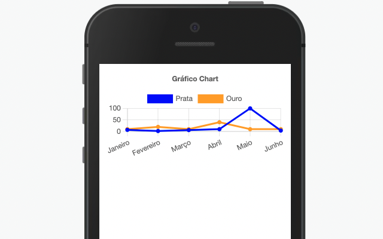
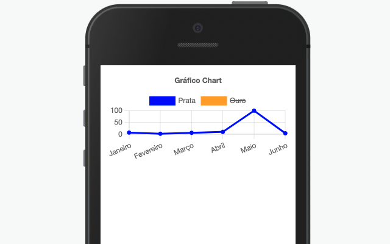

## Componente Chart.Line.



Utilizado para a exibição de de gráficos contendo sub-componentes do tipo: Bar, Line ou Pie.

## Utilização

```xml
state= {
       labels: ['Janeiro', 'Fevereiro', 'Março','Abril', 'Maio', 'Junho'],
       dataOptions:[
        {
            label:"Prata",
            data: [7, 2, 6,10,100,4],
            lineColor: 'blue',
            color: 'blue'
          },
          {
            label:"Ouro",
            data: [10, 20, 10, 40,10,10],
            lineColor: 'orange',
            color: 'orange'
          },
       ],
      }
<Chart.Line
    data={this.state.dataOptions}
    labels={this.state.labels}
    title="Gráfico em Linha"
/>
```

## Propriedades

| Propriedade | Descrição                                                                      | Type       | Default | Obrigatório |
| ----------- | ------------------------------------------------------------------------------ | ---------- | ------- | ----------- |
| labels      | Array de textos que conceberão as propriedades do gráfico.                     | String[]   | null    | sim         |
| data        | Array do tipo DataLine que vai definir os valores, cores das linhas no gráfico | DataLine[] | null    | sim         |
| title       | Título do gráfico                                                              | String     | null    | não         |
| position    | Posição do título no gráfico                                                   | String     | null    | não         |

## Exemplos

Abaixo, alguns exemplos usando o Chart.Line:

Possibilidade de ocultação de algum valor no clique

