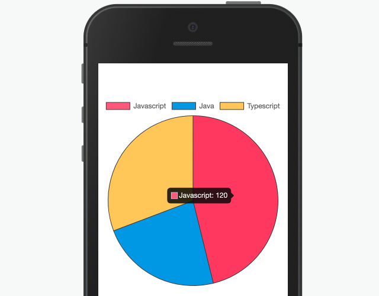
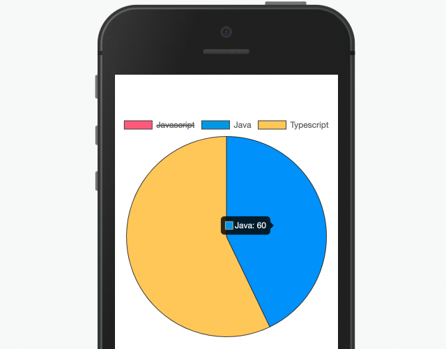

## Componente Chart.Pie.



Utilizado para a exibição de de gráficos contendo sub-componentes do tipo: Bar, Line ou Pie.

## Utilização

```xml
 state= {
       labels:['Javascript', 'Java', 'Typescript'],
       dataPieOptions:{
        label: 'Linguagens de programação',
        data: [120, 60, 80],
        backgroundColor: [
          'rgb(255, 99, 132)',
          'rgb(54, 162, 235)',
          'rgb(255, 206, 86)',
        ],
        borderColor: [
          '#444',
          '#444',
          '#444',
        ],
        borderWidth: 1,
      }
    }
<Chart.Pie
    data={this.state.dataPieOptions}
    labels={this.state.labels}
    title='Gráfico Pie'
/>
```

## Propriedades

| Propriedade | Descrição                                                                           | Type     | Default | Obrigatório |
| ----------- | ----------------------------------------------------------------------------------- | -------- | ------- | ----------- |
| labels      | Array de textos que conceberão as propriedades do gráfico.                          | String[] | null    | sim         |
| data        | Objeto do tipo DataPue que vai definir os valores e cores das das partes do gráfico | DataPie  | null    | sim         |

## Exemplos

Abaixo, alguns exemplos usando o Chart.Pie:

Possibilidade de ocultação de algum valor no clique


