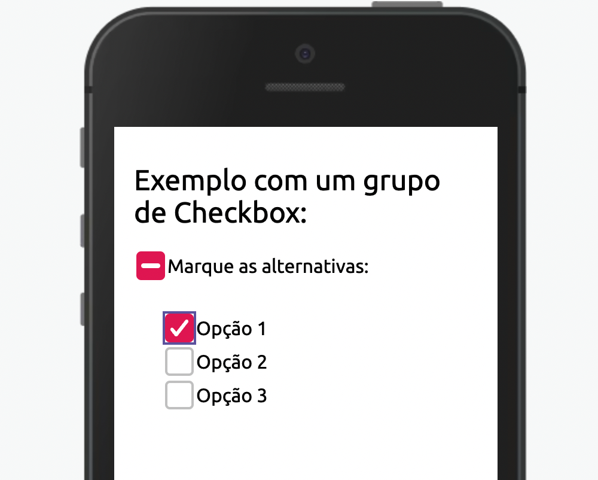

Caixa de seleção que permite que o usuário selecione um ou mais itens de um conjunto.

## Exemplo


<br>

## Modifique esse componente em tempo real pelo Storybook [clique aqui](https://ame-miniapp-components.calindra.com.br/storybook/?path=/story/intera%C3%A7%C3%B5es-checkitem--basic)

<br>

## Utilização

```xml

 state = {
    checked: false
  };

  <Checkbox
    dataCy='checkbox-test'
    variant='primary'
    id='3124129'
    value='teste'
    checked={this.state.checked}
    onChange={e => {
      this.setState({ checked: e.checked });
    }}
  />
```

## Propriedades

| Propriedade | Descrição                                                                                                      | Type     | Default   | Obrigatório |
| ----------- | -------------------------------------------------------------------------------------------------------------- | -------- | --------- | ----------- |
| checked     | Define o estado do checkbox                                                                                    | boolean  | false     | Sim         |
| onChange    | Função que retorna o estado e o value                                                                          | function | null      | Sim         |
| value       | Define o valor para o checkbox                                                                                 | string   | null      | Não         |
| disabled    | Desabilita o checkbox                                                                                          | boolean  | false     | Não         |
| id          | Passa um id para o componente                                                                                  | number   | aleatório | Não         |
| group       | Recebe um array com os estados de outros checkbox para controle do componente que recebe a propriedade 'group' | array    | null      | Não         |

## Exemplos

Abaixo, alguns exemplos usando um grupo de CheckBox:

<br>



```xml

 state = {
    groupChecked: false,
    t1Checked: false,
    t2Checked: false,
    t3Checked: false,
  };

  handleGroupCheck = e => {
    this.setState({
      groupChecked: e,
      t1Checked: e,
      t2Checked: e,
      t3Checked: e,
    });
  };

  <Window>
     <View padding='xxxs'>
        <View marginTop='xxxs'>
          <Text fontSize={'md'}>Exemplo com um grupo de Checkbox:</Text>
        </View>
        <View marginTop='xxxs'>
          <View direction='row' align='center'>
            <Checkbox
              value='teste'
              dataCy='group'
              group={[
                this.state.t1Checked,
                this.state.t2Checked,
                this.state.t3Checked,
              ]}
              checked={this.state.groupChecked}
              onChange={e => {
                this.handleGroupCheck(e.checked);
              }}
            />
            <Text> Marque as alternativas:</Text>
          </View>
          <View padding='xxs'>
            <View direction='row' align='center'>
              <Checkbox
                id='545135'
                dataCy='group-1'
                value='teste1'
                checked={this.state.t1Checked}
                onChange={e => {
                  this.setState({
                    t1Checked: e.checked,
                  });
                }}
              />
              <Text>Opção 1</Text>
            </View>
            <View direction='row' align='center'>
              <Checkbox
                id='545168515'
                dataCy='group-2'
                value='teste2'
                checked={this.state.t2Checked}
                onChange={e => {
                  this.setState({
                    t2Checked: e.checked,
                  });
                }}
              />
              <Text>Opção 2</Text>
            </View>
            <View direction='row' align='center'>
              <Checkbox
                id='541248135'
                dataCy='group-3'
                value='teste3'
                checked={this.state.t3Checked}
                onChange={e => {
                  this.setState({
                    t3Checked: e.checked,
                  });
                }}
              />
              <Text>Opção 3</Text>
            </View>
          </View>
        </View>
      </View>
  </Window>
```
