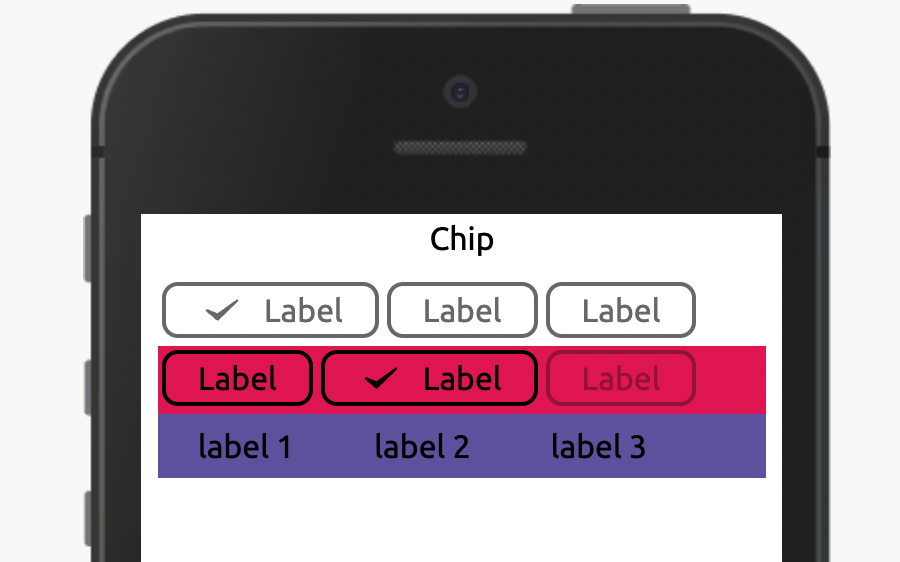

## Componente Chip.



## Utilização

```xml
 state = {
    data: [
      {
        id: 1,
        label: 'label 1',
        value: 'chip-7',
        variant: 'secondary',
      },
      {
        id: 2,
        label: 'label 2',
        value: 'chip-8',
        icon: '',
        variant: 'secondary',
      },
      {
        id: 3,
        label: 'label 3',
        value: 'chip-9',
        icon: '',
        variant: 'secondary',
      },
    ],
  };

  <Window>
    <View>
      <Text textAlign='center' fontSize='lg'>
        Chip
      </Text>
    </View>
    <View padding='nano'>
      <View
        marginBottom='quark'
        flexWrap='wrap'
        padding='quark'
        backgroundColor='none'>
        <View margin='quark' width='auto'>
          <Chip
            value='chip-1'
            icon='feedback-success'
            label='Label'
            onChange={(e) => console.log(e)}
          />
        </View>
        <View margin='quark' width='auto'>
          <Chip label='Label' value='chip-2' />
        </View>
        <View margin='quark' width='auto'>
          <Chip label='Label' value='chip-3' />
        </View>
      </View>
      <View
        marginBottom='quark'
        flexWrap='wrap'
        padding='quark'
        backgroundColor='primary'>
        <View margin='quark' width='auto'>
          <Chip variant='primary-inverse' label='Label' value='chip-4' />
        </View>
        <View margin='quark' width='auto'>
          <Chip
            dataCy='chip-teste'
            icon='feedback-success'
            variant='primary-inverse'
            label='Label'
            value='chip-5'
          />
        </View>
        <View margin='quark' width='auto'>
          <Chip
            dataCy='chip-teste-disabled'
            disabled
            variant='primary-inverse'
            label='Label'
            value='chip-6'
          />
        </View>
      </View>
      <View flexWrap='wrap' padding='quark' backgroundColor='secondary'>
        {this.state.data.map((item, index) => {
          return (
            <View key={index} margin='quark' width='auto'>
              <Chip
                icon={item.icon}
                variant='secondary'
                label={item.label}
                value={item.value}
                index={index}
                data={this.state.data}
                onChange={(e) => console.log(e)}
                dataChange={(e) => this.setState({ data: e })}
              />
            </View>
          );
        })}
      </View>
    </View>
  </Window>

```

## Propriedades

| Propriedade | Descrição                                                                                                    | Type    | Default | Obrigatório |
| ----------- | ------------------------------------------------------------------------------------------------------------ | ------- | ------- | ----------- |
| icon        | Ícone a ser exibido do lado esquerdo do label                                                                | String  | none    | não         |
| variant     | Define qual será o estilo do componente. Os valores aceitos são: 'primary', 'primary-inverse' ou 'secondary' | String  | primary | não         |
| label       | Texto a ser renderizado no componente                                                                        | String  | none    | sim         |
| active      | Ativa o componente selecionado                                                                               | Boolean | false   | não         |
| disabled    | Desabilita o componente                                                                                      | Boolean | false   | não         |
| value       | Valor do componente                                                                                          | String  | none    | sim         |
| onChange    | Retorna o value do componente                                                                                |
