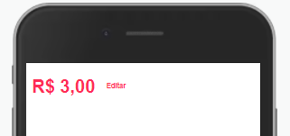
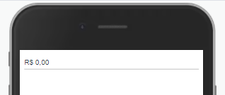

Exibe uma entrada de valor monetário na tela.

## Exemplo


<br>

## Modifique esse componente em tempo real pelo Storybook [clique aqui](https://ame-miniapp-components.calindra.com.br/storybook/?path=/story/intera%C3%A7%C3%B5es-currencyinput--basic)

<br>

## Utilização

```xml
<CurrencyInput
    maxLength={8}
    prefix={€}
    value={459}
    onChange={value => { ... }}
/>
```

## Propriedades

| Propriedade | Descrição                                                             | Type     | Default | Obrigatório |
| ----------- | --------------------------------------------------------------------- | -------- | ------- | ----------- |
| value       | Valor inicial que será renderizado no componente.                     | number   | null    | Sim         |
| onChange    | Função a ser executada quando o valor é alterado, retornando o valor, | function | null    | Sim         |
| prefix      | Prefixo do tipo de moeda utilizada. Padrão é R$                       | string   | R$      | Não         |
| maxLength   | Quantidade máxima de caracteres.                                      | number   | 9       | Não         |
| disableEdit | Esconde o botão Editar                                                | boolean  | false   | Não         |
| disabled    | Desabilita o componente.                                              | boolean  | false   | Não         |

## Exemplos

Abaixo, alguns exemplos usando o CurrencyInput:

<br>



```xml
<Window>
    <CurrencyInput
        maxLength={8}
        prefix='R$'
        value={300}
        onChange={value => {
            console.log(value);
        }}
    />
<Window>
```

<br>



```xml
<Window>
    <CurrencyInput
        flat
        maxLength={8}
        prefix='R$'
        value={0}
    />
<Window>
```
