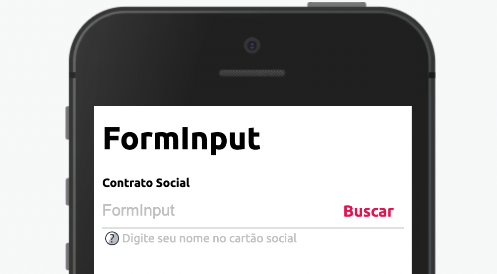

Modifique esse componente em tempo real pelo [Storybook](https://ame-miniapp-components.calindra.com.br/storybook/?path=/story/ilustrações-image--basic)

O Componente Image pode carregar tanto ícones padrões da Ame quanto imagens para compor os seus layouts



## Utilização

```xml
  state = {
    inputValue: '',
    statusText: '',
    showStatus: false,
    typeStatus: '',
    value: '',
  };

getInputValue = text => {
    this.setState({ inputValue: text });
    if (text.length <= 1) {
      this.setState({ showStatus: false });
    } else if (text.length < 8) {
      this.setState({ statusText: 'Recusado' });
      this.setState({ showStatus: true });
      this.setState({ typeStatus: 'error' });
    } else if (text.length > 13) {
      this.setState({ statusText: 'Em validação' });
      this.setState({ typeStatus: 'warning' });
    } else {
      this.setState({ statusText: 'Validado' });
      this.setState({ typeStatus: 'success' });
    }

    this.setState({ value: text });
  };


<FormInput
    placeholder='FormInput'
    label='Contrato Social'
    hint={{
    show: this.state.showStatus,
    text: this.state.statusText,
    type: this.state.typeStatus,
    }}
    value={this.state.value}
    onChange={e => this.getInputValue(e)}
    buttonRightClick={() => console.log('buttonRightClick clicado')}
    buttonRightText='Buscar'
    info='Digite seu nome no cartão social'
/>
```

## Propriedades

| Propriedade | Descrição                                                           | Type             | Default |
| ----------- | ------------------------------------------------------------------- | ---------------- | ------- |
| src         | Carrega a imagem tanto de require quanto com url                    | string, function | null    |
| cover       | Essa propriedade deixa a imagem com object-fill cover               | boolean          | false   |
| width       | Define a largura da imagem, pode ser usado em porcentagem ou pixels | string           | 100%    |
| height      | Define a altura da imagem, pode ser usado em porcentagem ou pixels  | string           | auto    |
| alt         | Insere um alt na imagem                                             | string           | null    |
| bordeRadius | Insere o borderRadius no componente                                 | string           | none    |
