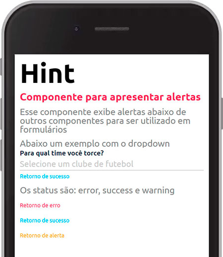
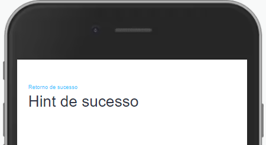

Componente para exibir alertas em formulários



Modifique esse componente em tempo real pelo [Storybook](https://ame-miniapp-components.calindra.com.br/storybook/?path=/story/textos-hint--basic)

<br>

## Utilização

```xml
  <Hint
    status='success'
    text='Retorno de sucesso'
    show={true}
  />
```

## Propriedades

| Propriedade | Descrição                                                                             | Type    | Default | Obrigatório |
| ----------- | ------------------------------------------------------------------------------------- | ------- | ------- | ----------- |
| type        | Define qual será o estilo do Hint, as propriedades são 'success', 'warning' e 'error' | string  | null    | Não         |
| show        | Parâmetro que define se o Hint será exibido ou não                                    | boolean | false   | não         |

## Exemplos

Abaixo, alguns exemplos usando o Hint:



```xml
<Window>
    <View>
      <Hint status='success' text='Retorno de sucesso' show />
      <Text fontSize='md'>Hint de sucesso</Text>
    </View>
<Window>
```
