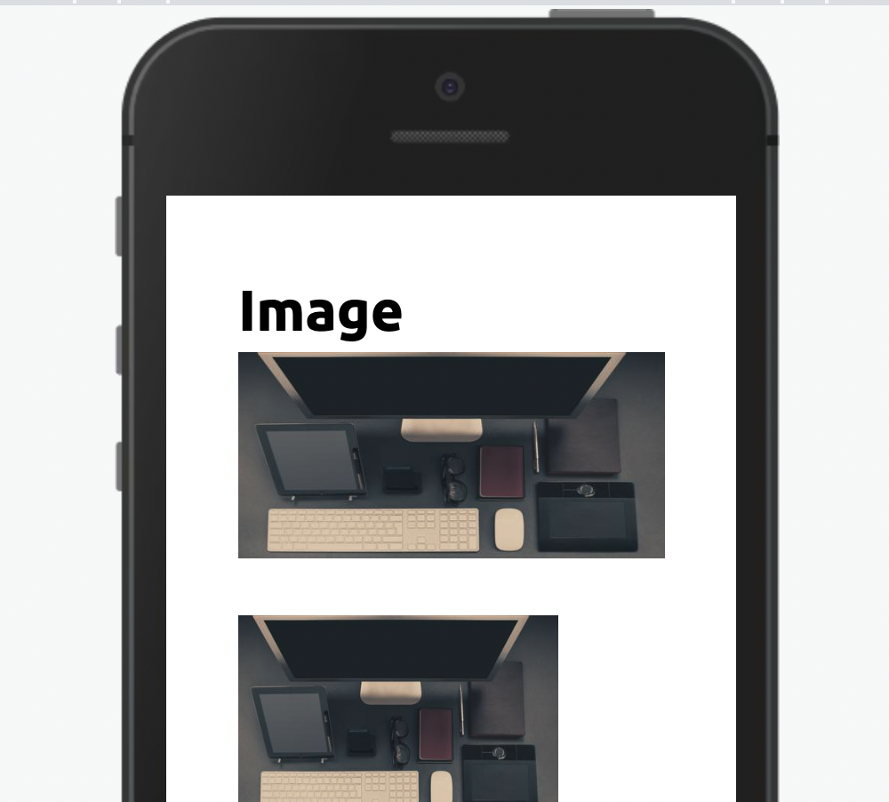

Modifique esse componente em tempo real pelo [Storybook](https://ame-miniapp-components.calindra.com.br/storybook/?path=/story/ilustrações-image--basic)

O Componente Image pode carregar tanto ícones padrões da Ame quanto imagens para compor os seus layouts



## Utilização

```xml
<Image src="<link_da_imagem>" alt="Uma Imagem" />
```

## Propriedades

| Propriedade | Descrição                                                           | Type             | Default |
| ----------- | ------------------------------------------------------------------- | ---------------- | ------- |
| src         | Carrega a imagem tanto de require quanto com url                    | string, function | null    |
| cover       | Essa propriedade deixa a imagem com object-fill cover               | boolean          | false   |
| width       | Define a largura da imagem, pode ser usado em porcentagem ou pixels | string           | 100%    |
| height      | Define a altura da imagem, pode ser usado em porcentagem ou pixels  | string           | auto    |
| alt         | Insere um alt na imagem                                             | string           | null    |
| bordeRadius | Insere o borderRadius no componente                                 | string           | none    |
