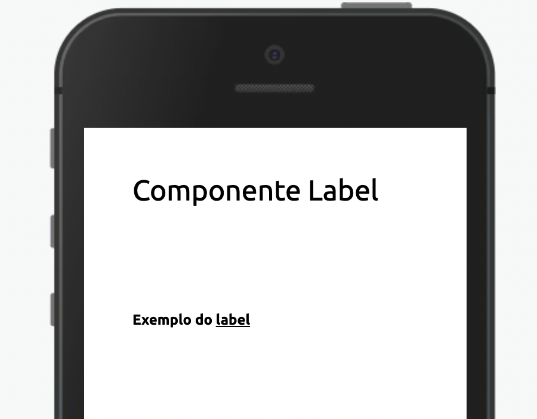

Componente select para seleção de itens



Modifique esse componente em tempo real pelo [Storybook](https://ame-miniapp-components.calindra.com.br/storybook/?path=/story/intera%C3%A7%C3%B5es-accordion--basic)

## Utilização

```xml
  <Label
    dataCy='label-teste'
    text='Exemplo do [u]label[/u]'
    htmlFor='inputName'>
    Exemplo do [u]label[/u]
  </Label>
```

## Propriedades

| Propriedade | Descrição                                                               | Type   | Default | Obrigatório |
| ----------- | ----------------------------------------------------------------------- | ------ | ------- | ----------- |
| htmlFor     | Define a qual elemento de form, através do id, o `Label` está atrelado. | string | null    | Não         |
