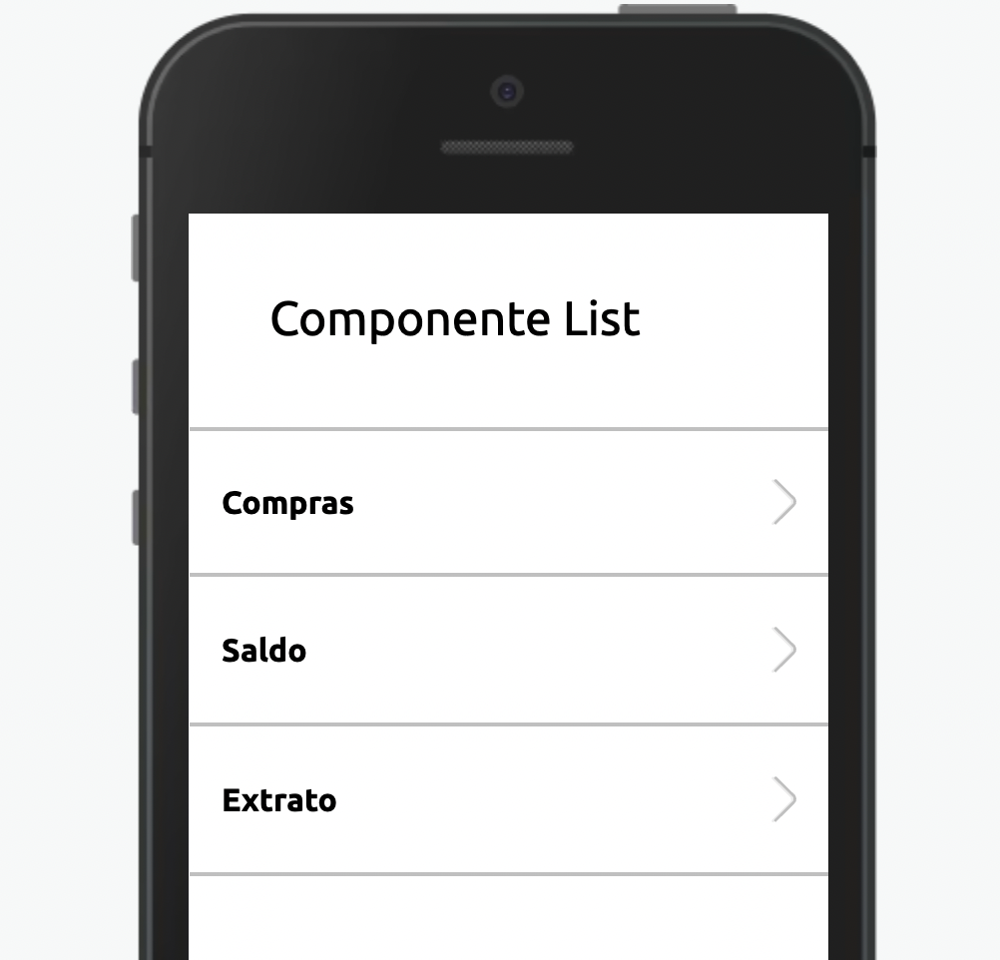

Este componente fornece uma lista útil para ser usada como um navegador, exibir produtos ou outras coisas.



<br>

## Modifique esse componente em tempo real pelo [Storybook](https://ame-miniapp-components.calindra.com.br/storybook/?path=/story/listas-listview--basic)

<br>

### Utilização

```xml harmony
state = {
  ListItems: [{ title: 'Compras' }, { title: 'Saldo' }, { title: 'Extrato' }]
}
goTo = (index) => {
  console.log(index)
}
<View padding="sm">
  <List items={this.state.ListItems} onItemPress={(i) => this.goTo(i)} />
</View>
```

## Propriedades

| Propriedade  | Descrição                                                                                                | Type     | Default | Obrigatório |
| ------------ | -------------------------------------------------------------------------------------------------------- | -------- | ------- | ----------- |
| items        | Recebe um array de objetos contendo a propriedade `title`.                                               | array    | null    | Sim         |
| disabled     | Desabilita o Componente.                                                                                 | boolean  | false   | Não         |
| onIntemPress | Função a ser executada quando um item é clicado. Retorna o index do item no array da propriedade `items` | function | null    | Não         |

### items

Valores aceitos em cada objeto do array. Todos os valores são do tipo `string`.

```js
{
  title: 'Titulo do item.'
}
```
