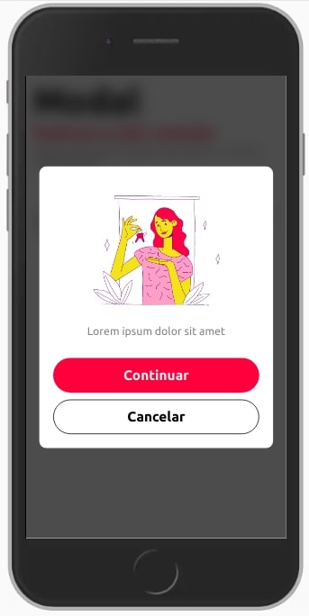
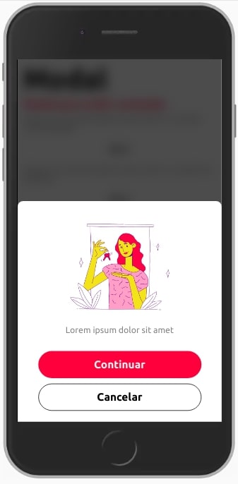

Componente que renderiza um modal no meio da tela ou a partir do bottom.



<br>

## Modifique esse componente em tempo real pelo Storybook [clique aqui](https://ame-miniapp-components.calindra.com.br/storybook/?path=/story/intera%C3%A7%C3%B5es-modal--basic)

<br>

## Utilização

```xml
<Modal
  show={showModal}
  position={position}
  closeModalCallback={this.closeModal}
>
  <Text>Lorem ipsum ....</Text>
</Modal>
```

## Propriedades

| Propriedade        | Descrição                                                                                                        | Type     | Default |
| ------------------ | ---------------------------------------------------------------------------------------------------------------- | -------- | ------- |
| show               | Essa propriedade recebe true ou false e controla a visibilidade do modal.                                        | boolean  | false   |
| position           | Position pode receber as strings bottom ou center (Veja nos exemplos no fim da página as diferenças entre eles). | string   | center  |
| closeModalCallback | Essa propriedade chama a função que muda o status presente em show, ela é acionada quando clica fora do modal.   | function | null    |

### Exemplos



Modal com

```xml
import img from '../assets/images/image_example.jpg';

 state = {
    showModal: false,
    position: 'center',
  };
  closeModal = () => {
    this.setState({
      showModal: false,
    });
  };
  openModal = position => {
    this.setState({
      showModal: true,
      position: position,
    });
  };

   <Modal
      show={showModal}
      position={position}
      closeModalCallback={this.closeModal}>
      <Image height={200} src={img} />
      <Text>Lorem ipsum dolor sit amet</Text>
      <View padding='nano'>
        <Button onPress={() => console.log('Continuar')}>Continuar</Button>
      </View>
      <View padding='nano'>
        <Button variant='secondary' onPress={() => this.closeModal()}>
          Cancelar
        </Button>
      </View>
    </Modal>
```
