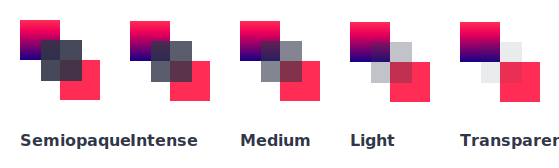

Em determinados momentos você pode sentir a necessidade de tornar um elemento um pouco translúcido.

Para isto você deve verificar se o componente presente aceita a propriedade **opacity**.

### Valores aceitos

Veja abaixo os valores aceitos pela propriedade opacity, começando da menor para a maior transparência:

- none: `none` = 1
- semiopaque: `semiopaque` = 0.8
- intense: `intense` = 0.64
- medium: `medium` = 0.4
- light: `light` = 0.32
- transparent: `transparent` = 0



### Modo de uso

Basta utilizar um dos valores acima dentro da propriedade opacity.

Exemplo:

```xml
<Window>
    <View opacity="transparent">
        <Text>Este texto está transparente</Text>
    </View>
</Window>
```
