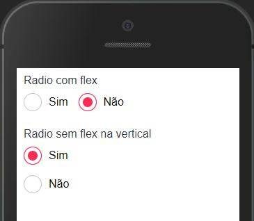

O Radio é usado para seleções únicas, onde somente uma opção pode ser selecionada



## Modifique esse componente em tempo real pelo [Storybook](https://ame-miniapp-components.calindra.com.br/storybook/?path=/story/intera%C3%A7%C3%B5es-radio--basic)

## Utilização

```xml
  <Radio
      name='primary'
      value='primary1'
      id='primary'
      checked={this.state.valueRadioSelected}
      onChange={value => {
        this.selectValue(value);
      }}
  />
```

## Propriedades

| Propriedade | Descrição                                                                                | Type     | Default   | Obrigatório |
| ----------- | ---------------------------------------------------------------------------------------- | -------- | --------- | ----------- |
| name        | Define o name do radio                                                                   | string   | null      | Sim         |
| checked     | Aqui é passado qual o value selecionado                                                  | string   | null      | Sim         |
| onChange    | Função que retorna o value                                                               | function | null      | Sim         |
| value       | Define o valor para o radio                                                              | string   | null      | Sim         |
| disabled    | Desabilita o radio                                                                       | boolean  | false     | Não         |
| id          | Passa um id para o componente                                                            | number   | aleatório | Não         |
| variant     | Define qual será o estilo do componente. Os valores aceitos são: 'primary' e 'secondary' | string   | primary   | Não         |
