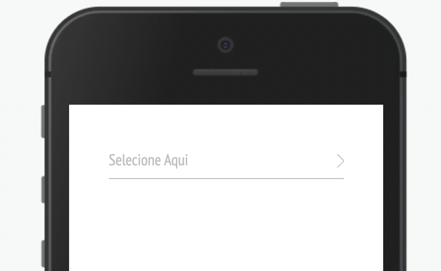

Componente select para seleção de itens



Modifique esse componente em tempo real pelo [Storybook](https://ame-miniapp-components.calindra.com.br/storybook/?path=/story/intera%C3%A7%C3%B5es-accordion--basic)

## Utilização

```xml
state = {
    selected: '',
  };
  options = [
    {
      label: 'teste 1',
      value: 'teste 1',
    },
    {
      label: 'teste 2',
      value: 'teste 2',
    },
    {
      label: 'teste 3',
      value: 'teste 3',
    },
    {
      label: 'teste 4',
      value: 'teste 4',
    },
    {
      label: 'teste 5',
      value: 'teste 5',
    },
    {
      label: 'teste 6',
      value: 'teste 6',
    },
  ];

  <Select
    label='Label do select'
    placeholder='Selecione Aqui'
    keySelectLabel='label'
    options={this.options}
    value={this.state.selected}
    onChange={e => this.setState({ selected: e })}
  />
```

## Propriedades

| Propriedade    | Descrição                                                                                                | Type             | Default | Obrigatório |
| -------------- | -------------------------------------------------------------------------------------------------------- | ---------------- | ------- | ----------- |
| options        | Array de objetos contendo valores de `label` e `value`.                                                  | array            | null    | Sim         |
| value          | Valor que pode ser passado para iniciar o componente.                                                    | string ou objeto | null    | Sim         |
| keySelectLabel | Indica se o valor informado como value e o retorno da função OnChange é o `label` ou o `value do objeto. | string           | label   | Não         |
| disabled       | Desabilita o componente.                                                                                 | boolean          | false   | Não         |
| onChange       | Função a ser executada quando selecionar valor, deve alimentar o estado do `value`.                      | function         | null    | Sim         |
| placeholder    | Texto descritivo dentro do Select caso o value inicial seja vazio.                                       | string           | null    | Não         |
