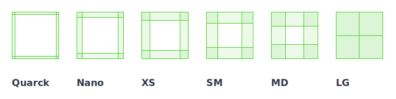
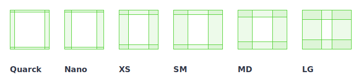

## Espaçamento

Em determinados momentos você precisará de uso de espaçamentos, para isso você poderá usar as propriedades **inset**,**padding** e **margin**.

### Valores aceitos

Abaixo segue uma lista dos valores de espaçamento para a propriedade **inset**, **padding** e **margin**, do maior para o menor.

- None: `none = 0px`
- Quarck: `quarck = 4px`
- Nano: `nano = 8px`
- Extra small: `extra-small = 16px`
- Small: `small = 24px`
- Medium: `medium = 30px`
- Large: `large = 40px`
- Extra Large: `extra-large = 48px`
- Big: `big = 56px`
- Display: `display = 64px`
- Huge: `huge = 80px`
- Giant: `giant = 230px`
- Jumbo: `jumbo = 160px`
- Immense: `immense = 200px`



Abaixo segue uma lista dos valores de espaçamento para a propriedade **squish**, do maior para o menor

**_Deprecated_**

- Quarck: `quarck` = 5px 10px
- Nano: `nano` = 5px 15px
- Extra small: `xs` = 10px 20px
- Small: `sm` = 10px 30px
- Medium: `md` = 15px 30px
- Large: `lg` = 20px 40px



No squish as dimensões são ligeiramente maiores na horizontal.

### Modo de uso

Exemplo:

```xml
<Window>
    <View inset="none"> ... </View>
    <View inset="quarck"> ... </View>
    <View padding="nano"> ... </View>
    <View padding="extra-small"> ... </View>
    <View margin="small"> ... </View>
    <View margin="medium"> ... </View>
</Window>
```
