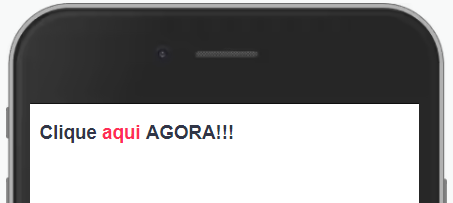

Executa a função semelhante a um link html. Evite o uso excessivo.


Modifique esse componente em tempo real pelo [Storybook](https://ame-miniapp-components.calindra.com.br/storybook/?path=/story/textos-textlink--basic)

## Utilização

O TextLink pode ser usado com o Text, assim você consegue controlar o tamanho da fonte sem precisar passar um parâmetro para o text e outro para o textLink por exemplo.

```xml
<Text size='md'>
  Um texto qualquer
  <TextLink onClick='() => { funcaoClick() }'/> Texto Link </TextLink>
  [b]um texto bold[/b]
</Text>
```

## Propriedades

| Propriedade | Descrição                                                        | Type     | Default | Obrigatório |
| ----------- | ---------------------------------------------------------------- | -------- | ------- | ----------- |
| onPress     | Recebe uma função para ser executada ao pressionarmos o TextLink | function | null    | Sim         |

## Exemplos

Abaixo, alguns exemplos usando o TextLink:



```xml
<View>
  <Text size='lg'>
    [b]Clique[/b]
    <TextLink onClick={() => this.handleClick()} /> aqui </TextLink>
    [b]AGORA!!![/b]
  </Text>
</View>
```

Usamos {' '} para espaço porque em muitos casos o prettier com o eslint pulará uma linha, com o {' '} você consegue forçar o espaço no texto.
