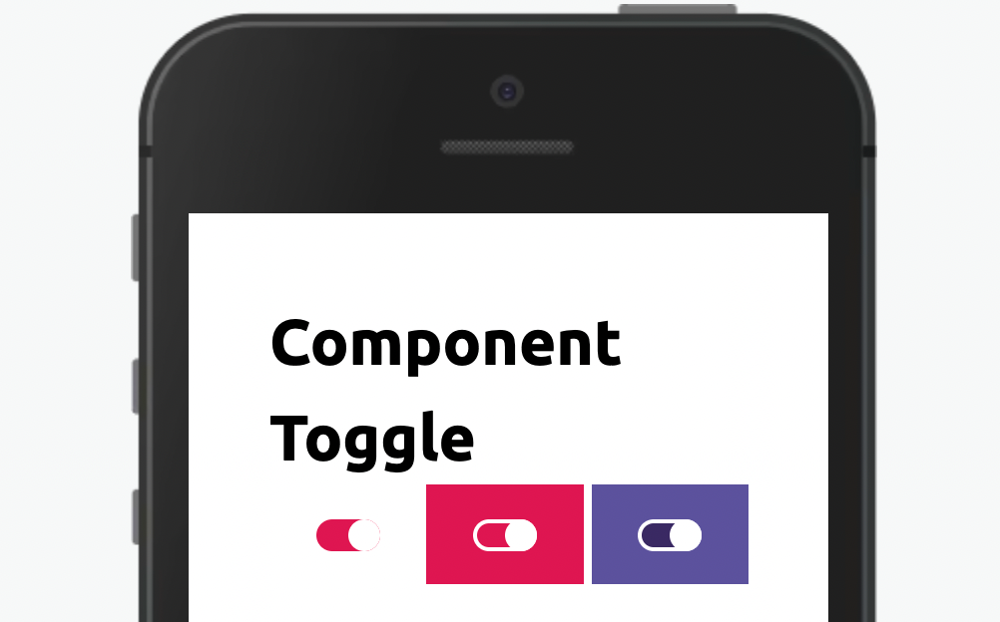

Componente para escolhas com retorno true e false.



Modifique esse componente em tempo real pelo [Storybook](https://ame-miniapp-components.calindra.com.br/storybook/?path=/story/intera%C3%A7%C3%B5es-toggle--basic)

## Utilização

```xml harmony
state = {
  checked: false
}

<Toggle
  variant="primary"
  checked={this.state.checked}
  value="teste"
  onChange={(e) => this.setState({ checked: e.state })}
/>
```

## Propriedades

| Propriedade | Descrição                                                                                                    | Type     | Default |
| ----------- | ------------------------------------------------------------------------------------------------------------ | -------- | ------- |
| checked     | Define se o Toggle está ou não ativo                                                                         | boolean  | false   |
| disabled    | Desabilita o componente                                                                                      | boolean  | false   |
| value       | Valor atribuído ao componente                                                                                | string   | null    |
| id          | Atribui um id ao Toggle                                                                                      | string   | null    |
| onChange    | Função que retorna o estado do componente.                                                                   | function | null    |
| variant     | Define qual será o estilo do componente. Os valores aceitos são: 'primary', 'primary-inverse' ou 'secondary' | string   | primary |

## Exemplos

Abaixo um exemplo do toggle sendo usado em aceite de termos e etc.


```xml harmony
state = {
  checked: false
}
<View align="center">
  <Toggle
    variant="primary"
    checked={this.state.checked}
    value="teste"
    onChange={(e) => this.setState({ checked: e.state })}
  />
  <View paddingLeft="nano">
    <Text>
      Aceito os{' '}
      <TextLink text="termos de uso" onClick={() => console.log('clique')} />
    </Text>
  </View>
</View>
```
