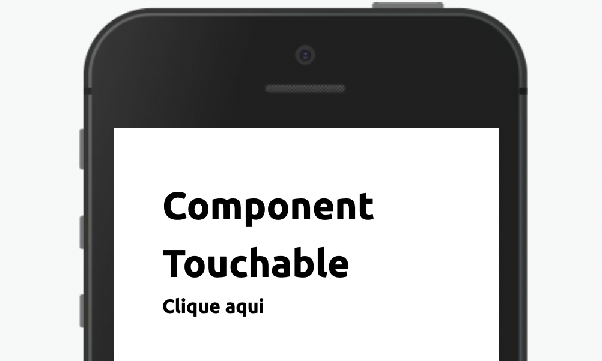

Envolva um componente com Touchable para que ele passe a ter interação.



Modifique esse componente em tempo real pelo Storybook [clique aqui](https://ame-miniapp-storybook.calindra.com.br/mobile/v2/?path=/story/intera%C3%A7%C3%B5es-touchable--basic)

## Utilização

```xml
<Touchable onClick={() => {console.log('Clicado!')}}>
  <Text>Agora sou clicável</Text>
</Touchable>
```

## Propriedades

| Propriedade     | Descrição                                                     | Type     | Default |
| --------------- | ------------------------------------------------------------- | -------- | ------- |
| onPress         | Função que será chamada ao tocar no componente.               | function | null    |
| disabledOnPress | Função que será chamada caso o Touchable esteja desabilitado. | function | null    |
| disabled        | Desabilita o componente                                       | boolean  | false   |
| width           | Define a largura do componente                                | string   | null    |
| height          | Define a altura do componente                                 | string   | null    |
